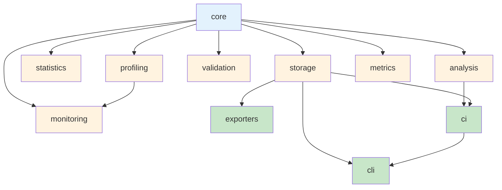

# Module Map

Calibrax is organized into 11 modules with clear dependency layers.

## Import Dependency Graph

**Colors:**

- Light blue — foundation layer (data models, protocols)
- Light orange — processing layer (profiling, analysis, statistics, validation,
  storage, monitoring, metrics)
- Light green — output layer (exporters, CI, CLI)

## Layer Classification

| Layer | Modules | Description |
|-------|---------|-------------|
| **Foundation** | `core` | Data models, protocols, adapters, registry, result container |
| **Processing** | `profiling`, `statistics`, `analysis`, `validation`, `storage`, `metrics`, `monitoring` | Profiling, statistical analysis, regression detection, validation, data persistence, metrics computation, alerting |
| **Output** | `exporters`, `ci`, `cli` | External integrations, CI gating, command-line interface |

Imports flow **downward only**: output modules depend on processing modules,
which depend on the foundation. No circular dependencies exist.

## Module Contents

| Module | Submodules | Public Symbols | Description |
|--------|-----------|----------------|-------------|
| `core` | `models`, `protocols`, `adapters`, `registry`, `result` | ~30 | Data models, enums, protocols, adapters, registry, result container |
| `profiling` | `timing`, `resources`, `gpu`, `energy`, `flops`, `hardware`, `roofline`, `compilation`, `complexity`, `tracing`, `carbon` | ~25 | Timing, resources, GPU, energy, FLOPs, hardware detection, roofline analysis, compilation profiling, complexity analysis, XLA tracing, carbon tracking |
| `statistics` | `analyzer`, `significance` | ~8 | Statistical analyzer, significance tests, effect size |
| `analysis` | `regression`, `ranking`, `comparison`, `scaling`, `pareto`, `changepoint` | ~10 | Regression detection, ranking, comparison reports, scaling laws, Pareto fronts, changepoint detection |
| `validation` | `framework`, `convergence`, `accuracy` | ~6 | Validation reports, convergence checking, accuracy assessment |
| `monitoring` | `monitor`, `production` | ~6 | Alert management, threshold monitoring, pipeline health |
| `storage` | `store` | ~2 | JSON store with baseline management |
| `exporters` | `base`, `wandb`, `mlflow`, `publication` | ~5 | Exporter ABC, W&B integration, MLflow integration, publication output |
| `metrics` | `functional/` (17 domains), `stateful/`, `learning/`, `plugins/`, `composition`, `wrappers`, `_registry` | 111 registered | 4-tier metric system: pure functions, frozen backbone, learned (NNX), metric learning losses; registry with axiom-based discovery |
| `ci` | `guard`, `bisection` | ~4 | CI guard, bisection engine |
| `cli` | `main` | ~1 | Click command group |

## Key Design Constraints

- **`core` depends only on `profiling`** — `core.result` imports
  `TimingSample` and `ResourceSummary` for serialization; otherwise `core`
  depends only on JAX, Flax NNX (for adapters), and the standard library
- **`exporters` does not import `wandb` or `matplotlib` at the module level** —
  optional dependencies are guarded by availability flags
- **`ci` depends on `analysis` and `storage`** — it composes regression detection
  with store-based baseline management
- **`cli` is the only module that calls `sys.exit()`** — all other modules
  return results for programmatic handling
