# Example Documentation Design Framework

> **Purpose**: Establish unified standards for creating educational examples and tutorials
> for the Calibrax unified benchmarking framework.

---

## Table of Contents

1. [Executive Summary](#1-executive-summary)
2. [Design Philosophy](#2-design-philosophy)
3. [Documentation Architecture](#3-documentation-architecture)
4. [Documentation Location Strategy](#4-documentation-location-strategy)
5. [Dual-Format Implementation](#5-dual-format-implementation)
6. [Output Capture Requirements](#6-output-capture-requirements)
7. [Framework Migration Guides](#7-framework-migration-guides)
8. [Content Principles](#8-content-principles)
9. [Visual Design System](#9-visual-design-system)
10. [Documentation Tiers](#10-documentation-tiers)
11. [Component Library](#11-component-library)
12. [Writing Guidelines](#12-writing-guidelines)
13. [Code Example Standards](#13-code-example-standards)
14. [Implementation Workflow](#14-implementation-workflow)
15. [Quality Checklist](#15-quality-checklist)
16. [Examples Demonstrating Principles](#16-examples-demonstrating-principles)
17. [Maintenance & Updates](#17-maintenance-updates)
18. [Metrics Module Documentation Patterns](#18-metrics-module-documentation-patterns)
19. [Quick Reference Summary](#19-quick-reference-summary)

---

## 1. Executive Summary

### Purpose

This document defines complete standards for documenting Calibrax examples and
tutorials. It ensures consistent, high-quality educational content that serves users
from first-time learners to production ML engineers building robust benchmarking
pipelines for JAX/Flax NNX models.

### Key Capabilities

Calibrax provides a JAX-native unified benchmarking framework with:

- Timing and resource profiling (CPU, GPU, energy, FLOPs)
- Statistical analysis with bootstrap confidence intervals
- Direction-aware regression detection
- Cross-configuration comparison and ranking
- Pareto front analysis for multi-objective optimization
- JSON-per-run storage with baseline management
- W&B and publication-ready exporters
- CI regression gates with git bisect automation
- Production monitoring with alerting
- CLI for all operations
- Extensible metrics framework (110+ registered metrics across 4 tiers: pure functions, frozen backbone, learned, metric learning)
- Geometric distance hierarchy (Euclidean, Riemannian, Finsler, pseudo-Riemannian, graph)
- Metric registry with axiom-based discovery and invariance-based selection

### Three Core Objectives

| Objective | Description |
|-----------|-------------|
| **Educational Excellence** | Clear explanations with measurable learning outcomes for benchmarking and performance analysis concepts |
| **Visual Appeal** | Beautiful, consistent presentation using Material for MkDocs |
| **Practical Utility** | Copy-paste ready code that runs successfully with real benchmarks |

### Three Documentation Tiers

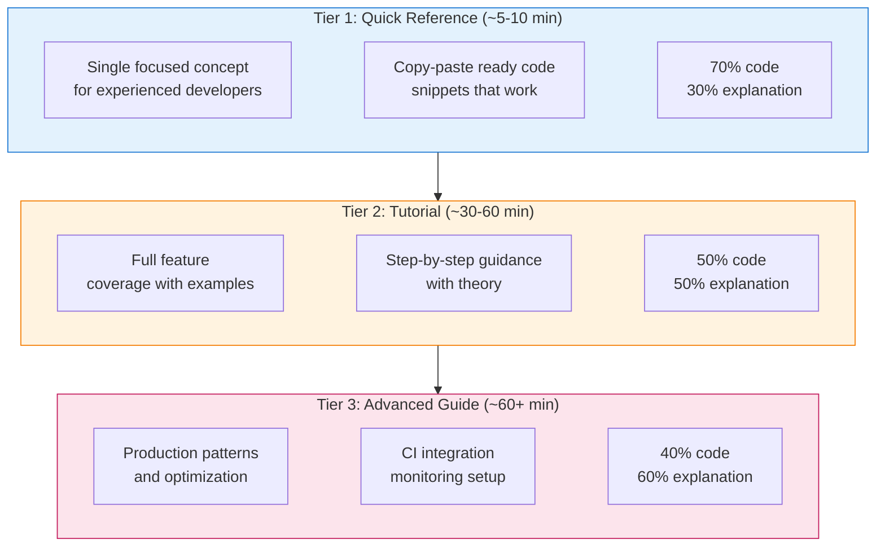

---

## 2. Design Philosophy

### Five Core Principles

These principles guide every documentation decision in Calibrax:

#### 2.1 Progressive Disclosure

**Start simple, add complexity gradually.**

Users should be able to measure basic timing with minimal code, then progressively
add statistical analysis, regression detection, storage, and CI integration as they
understand each concept.

```python
# doctest: +SKIP — illustrative progressive disclosure template
# Level 1: Minimal timing measurement (4 lines)
from calibrax.profiling import TimingCollector

collector = TimingCollector()
sample = collector.measure_iteration(data_iterator, num_batches=100)
print(f"Wall clock: {sample.wall_clock_sec:.3f} sec ({sample.num_batches} batches)")

# Level 2: Add resource monitoring
from calibrax.profiling import ResourceMonitor

with ResourceMonitor(sample_interval_sec=0.1) as monitor:
    train(model, data)
summary = monitor.summary
print(f"Peak memory: {summary.peak_rss_mb:.0f} MB")

# Level 3: Store results and detect regressions
from calibrax.storage import Store
from calibrax.analysis import detect_regressions

store = Store(Path("benchmark-data"))
store.save(run)
regressions = detect_regressions(current_run, baseline, threshold=0.05)

# Level 4: CI integration with regression gates
from calibrax.ci import CIGuard

guard = CIGuard(store, threshold=0.05)
result = guard.check()  # checks latest run against baseline
```

**Application in Documentation**:

- Quick Reference shows Level 1-2 only
- Tutorials progress through Level 1-3
- Advanced Guides cover Level 3-4 with production considerations

**Metrics module progressive disclosure follows the same pattern:**

```python
# Level 1: Single metric call (1 line)
from calibrax.metrics.functional.regression import mse
error = mse(predictions, targets)

# Level 2: Registry discovery and batch computation
from calibrax.metrics import MetricRegistry, calculate_all
results = calculate_all(predictions, targets)
true_metrics = MetricRegistry().list_true_metrics()  # metrics satisfying metric axioms

# Level 3: Composition with CI gates
from calibrax.metrics import MetricCollection, ThresholdMetric
collection = MetricCollection.from_registry(domain="general")
gate = ThresholdMetric("mse", max_value=0.01)

# Level 4: Metric learning with training loop
from calibrax.metrics.learning import ContrastiveLoss, HardNegativeMiner
loss_fn = ContrastiveLoss(margin=1.0)
```

#### 2.2 Learning by Doing

**Every concept has runnable benchmarking code.**

Theory sections should be concise. Users learn benchmarking by measuring real
workloads, not by reading about them. Every theoretical concept should be immediately
followed by executable code.

`````markdown
<!-- Theory (brief) -->
## Understanding Bootstrap Confidence Intervals

Bootstrap confidence intervals provide non-parametric uncertainty estimates
for benchmark metrics. By resampling the observed measurements with replacement,
we construct a distribution of the statistic without assuming normality.

<!-- Practice (immediate) -->
## Try It: Computing Confidence Intervals

```python
# doctest: +SKIP — template showing API usage pattern
from calibrax.statistics import StatisticalAnalyzer

analyzer = StatisticalAnalyzer()
result = analyzer.summarize(measurements)
print(f"Mean: {result.mean:.4f}")
print(f"95% CI: [{result.ci_lower:.4f}, {result.ci_upper:.4f}]")
print(f"Stable: {result.is_stable}")
```
`````

#### 2.3 Multiple Learning Paths

**Different users have different needs.**

| User Type | Needs | Best Tier |
|-----------|-------|-----------|
| Experienced ML engineer | Quick syntax reminder | Tier 1 Quick Reference |
| First-time Calibrax user | Guided learning path | Tier 2 Tutorial |
| CI/CD engineer | Regression gates, automation | Tier 3 Advanced Guide |
| Researcher comparing models | Analysis and export tools | Tier 2 with analysis focus |

**Documentation should support all paths without forcing users through unnecessary content.**

#### 2.4 Beautiful and Functional

**Visual design serves learning, not decoration.**

Good visual design reduces cognitive load and helps users understand relationships
between concepts. Calibrax documentation uses Material for MkDocs features purposefully:

| Element | Purpose | Example Usage |
|---------|---------|---------------|
| Cards | Group related quick-start options | Example overview page |
| Callouts | Highlight important information | Warnings about statistical significance |
| Tables | Compare options or show specifications | Metric definitions, profiler configurations |
| Code blocks | Executable examples with highlighting | All code examples |
| Mermaid diagrams | Show benchmarking pipeline and data flow | Profiling workflow, CI integration |

#### 2.5 Trust Through Transparency

**Users should know exactly what to expect.**

Every example should clearly communicate:

- **Runtime estimate**: "~5 min (CPU) / ~2 min (GPU)"
- **Memory requirements**: "~1 GB RAM, ~2 GB VRAM for GPU profiling"
- **Prerequisites**: Links to required background knowledge
- **Device compatibility**: CPU/GPU/TPU support status
- **Expected output**: Comments showing what users will see

```python
# Expected output:
# Timing: 1.234 sec (100 batches)
# Throughput: 2592 samples/sec
# Peak memory: 1847 MB
# Regressions detected: 0
```

---

## 3. Documentation Architecture

### Three-Tier System Overview

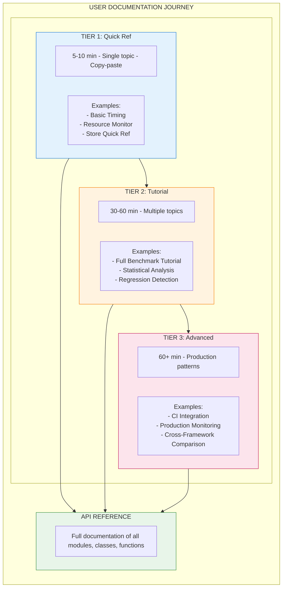

### When to Use Each Tier

| Scenario | Recommended Tier | Rationale |
|----------|------------------|-----------|
| "How do I time a JAX function?" | Tier 1 | Single concept, quick answer |
| "Never used Calibrax before" | Tier 2 | Needs guided introduction |
| "How do I set up CI regression gates?" | Tier 3 | Complex production topic |
| "How do I compare two model configs?" | Tier 2 | Overview of multiple concepts |
| "How do I debug flaky benchmarks?" | Tier 3 | Requires deep understanding |

### User Journey Through Documentation

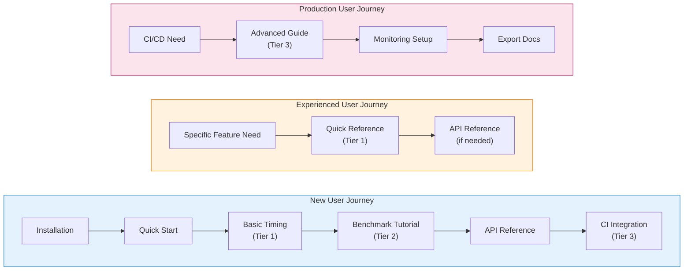

---

## 4. Documentation Location Strategy

### Directory Structure

Calibrax separates documentation from code, following a clean pattern where markdown
files in `docs/examples/` explain and link to runnable code in `examples/`.

!!! note "Current vs Planned Structure"
    The directory tree below shows the **target structure**. Currently, only
    `examples/metrics/` (8 examples with Jupyter notebooks) exists. The `core/`,
    `analysis/`, `integration/`, and `advanced/` directories are planned for future
    expansion. Use the metrics examples as the reference implementation.

```text
calibrax/
├── docs/
│   ├── assets/
│   │   └── examples/
│   │       ├── basic_timing/                   # Asset folder (NO _files suffix)
│   │       ├── benchmark_tutorial/
│   │       ├── regression_detection/
│   │       └── ...                             # Per-example asset folders
│   └── examples/
│       ├── index.md                            # Entry point with cards
│       ├── core/
│       │   ├── basic-timing.md                 # Docs for basic timing
│       │   ├── resource-monitoring.md          # Docs for resource monitoring
│       │   ├── benchmark-tutorial.md           # Docs for full benchmark tutorial
│       │   ├── adapters-quickref.md            # Docs for adapter quick ref
│       │   └── storage-quickref.md             # Docs for storage quick ref
│       │
│       ├── analysis/
│       │   ├── statistics-quickref.md          # Docs for statistical analysis
│       │   ├── regression-detection.md         # Docs for regression detection
│       │   ├── comparison-tutorial.md          # Docs for comparison tutorial
│       │   ├── ranking-tutorial.md             # Docs for ranking tutorial
│       │   └── pareto-tutorial.md              # Docs for Pareto analysis
│       │
│       ├── integration/
│       │   ├── wandb/
│       │   │   └── wandb-quickref.md           # Docs for W&B integration
│       │   ├── mlflow/
│       │   │   └── mlflow-quickref.md          # Docs for MLflow integration
│       │   └── publication/
│       │       └── publication-quickref.md     # Docs for publication export
│       │
│       └── advanced/
│           ├── ci/
│           │   ├── ci-guard-quickref.md
│           │   └── ci-integration-guide.md
│           ├── monitoring/
│           │   └── production-monitoring-guide.md
│           ├── profiling/
│           │   ├── gpu-profiling-tutorial.md
│           │   ├── roofline-analysis-guide.md
│           │   └── energy-monitoring-tutorial.md
│           └── distributed/
│               └── multi-device-benchmarking-guide.md
│
├── examples/                                    # Runnable code files
│   ├── README.md                                # Examples overview and guide
│   ├── _templates/
│   │   └── example_template.py                  # Template for new examples
│   │
│   ├── core/
│   │   ├── 01_basic_timing.py                   # Tier 1: Quick Reference
│   │   ├── 01_basic_timing.ipynb                # Generated notebook
│   │   ├── 02_resource_monitoring.py            # Tier 1: Resource monitoring
│   │   ├── 02_resource_monitoring.ipynb
│   │   ├── 03_benchmark_tutorial.py             # Tier 2: Full tutorial
│   │   ├── 03_benchmark_tutorial.ipynb
│   │   ├── 04_adapters_quickref.py              # Tier 1: Adapters
│   │   ├── 04_adapters_quickref.ipynb
│   │   ├── 05_storage_quickref.py               # Tier 1: Storage
│   │   └── 05_storage_quickref.ipynb
│   │
│   ├── analysis/
│   │   ├── 01_statistics_quickref.py            # Tier 1: Statistics
│   │   ├── 01_statistics_quickref.ipynb
│   │   ├── 02_regression_detection.py           # Tier 2: Regressions
│   │   ├── 02_regression_detection.ipynb
│   │   ├── 03_comparison_tutorial.py            # Tier 2: Comparison
│   │   ├── 03_comparison_tutorial.ipynb
│   │   ├── 04_ranking_tutorial.py               # Tier 2: Ranking
│   │   ├── 04_ranking_tutorial.ipynb
│   │   ├── 05_pareto_tutorial.py                # Tier 2: Pareto front
│   │   └── 05_pareto_tutorial.ipynb
│   │
│   ├── integration/
│   │   ├── wandb/
│   │   │   ├── 01_wandb_quickref.py
│   │   │   └── 01_wandb_quickref.ipynb
│   │   ├── mlflow/
│   │   │   ├── 01_mlflow_quickref.py
│   │   │   └── 01_mlflow_quickref.ipynb
│   │   └── publication/
│   │       ├── 01_publication_quickref.py
│   │       └── 01_publication_quickref.ipynb
│   │
│   ├── advanced/
│   │   ├── ci/
│   │   │   ├── 01_ci_guard_quickref.py
│   │   │   ├── 01_ci_guard_quickref.ipynb
│   │   │   ├── 02_ci_integration_guide.py       # Tier 3: Full CI guide
│   │   │   └── 02_ci_integration_guide.ipynb
│   │   ├── monitoring/
│   │   │   ├── 01_production_monitoring_guide.py # Tier 3: Production
│   │   │   └── 01_production_monitoring_guide.ipynb
│   │   ├── profiling/
│   │   │   ├── 01_gpu_profiling_tutorial.py
│   │   │   ├── 01_gpu_profiling_tutorial.ipynb
│   │   │   ├── 02_roofline_analysis_guide.py    # Tier 3: Roofline
│   │   │   ├── 02_roofline_analysis_guide.ipynb
│   │   │   ├── 03_energy_monitoring_tutorial.py
│   │   │   └── 03_energy_monitoring_tutorial.ipynb
│   │   └── distributed/
│   │       ├── 01_multi_device_benchmarking_guide.py
│   │       └── 01_multi_device_benchmarking_guide.ipynb
│   │
│   └── utils/                                   # Shared utilities
│       ├── __init__.py
│       └── sample_workloads.py
│
├── benchmarks/                                  # Standalone benchmark scripts
│   ├── model_comparison_benchmark.py
│   └── framework_scaling_benchmark.py
│
└── mkdocs.yml                                   # Navigation configuration
```

### File Naming Conventions

| Location | Pattern | Example |
|----------|---------|---------|
| `docs/examples/` | `kebab-case.md` | `basic-timing.md` |
| `examples/` | `NN_snake_case.py` | `01_basic_timing.py` |
| `examples/` | `NN_snake_case.ipynb` | `01_basic_timing.ipynb` |
| `docs/assets/examples/` | `snake_case/` | `basic_timing/` |

**Note**: Asset directories use `snake_case` (NOT `*_files/` suffix). The directory name should match the example name.

### Relationship Between `docs/examples/` and `examples/`

```text
docs/examples/               # Documentation (markdown files)
    └── metrics/
        └── quickstart.md            # Explains the example, links to code

examples/                    # Runnable code (Python + Jupyter)
    └── metrics/
        ├── 01_quickstart.py         # Source file with Jupytext markers
        └── 01_quickstart.ipynb      # Generated notebook
```

**Key Principle**: Documentation and code are separated. Markdown files in
`docs/examples/` explain concepts and link to the actual code in `examples/`.

### Documentation Page Structure

Each markdown file in `docs/examples/` follows this pattern:

`````markdown
# Basic Timing Quick Reference

| Metadata | Value |
|----------|-------|
| **Level** | Beginner |
| **Runtime** | ~5 min (CPU) |
| **Prerequisites** | Basic Python, JAX fundamentals |
| **Format** | Python + Jupyter |

## Overview

[Description of what this example demonstrates]

## What You'll Learn

- [Learning goal 1]
- [Learning goal 2]
- [Learning goal 3]

## Files

- **Python Script**: [`examples/metrics/01_quickstart.py`](https://github.com/avitai/calibrax/blob/main/examples/metrics/01_quickstart.py)
- **Jupyter Notebook**: [`examples/metrics/01_quickstart.ipynb`](https://github.com/avitai/calibrax/blob/main/examples/metrics/01_quickstart.ipynb)

## Quick Start

### Run the Python Script

```bash
source activate.sh && python examples/metrics/01_quickstart.py
```

### Run the Jupyter Notebook

```bash
jupyter lab examples/metrics/01_quickstart.ipynb
```

## Key Concepts

[Explanation of concepts demonstrated in this example]

## Example Code

```python
# doctest: +SKIP — template
[Key code snippets from the example]
```

## Next Steps

- [Link to related example]
- [Link to API reference]
`````

**Guidelines**:

- `docs/examples/` contains **markdown files only** that explain examples
- `examples/` contains **all runnable code** (`.py` and `.ipynb` files)
- Markdown files link to code via GitHub URLs for easy navigation
- The `.py` file is the source of truth; `.ipynb` is generated via Jupytext
- Keep documentation and code in sync when making changes

---

## 5. Dual-Format Implementation

### Philosophy

Calibrax examples use a **dual-format approach**:

1. **Python scripts (`.py`)** as the source of truth
2. **Jupyter notebooks (`.ipynb`)** generated automatically via Jupytext

This ensures code is:

- Version-controllable (clean diffs in `.py` files)
- IDE-friendly (full Python tooling support)
- Interactive (Jupyter for exploration)
- Consistent (single source, two formats)

### Jupytext Header Format

Every Python example file MUST include a Jupytext header:

```python
# ---
# jupyter:
#   jupytext:
#     formats: py:percent,ipynb
#     text_representation:
#       extension: .py
#       format_name: percent
#       format_version: '1.3'
# ---
```

### Cell Marker Format

```python
# %% [markdown]
"""
# Title of Section

Markdown content goes here with **formatting**, `code`, and lists:

- Item 1
- Item 2
"""

# %%
# Python code cell
import calibrax
print("This is executable code")

# %% [markdown]
"""
## Another Markdown Section

More explanation here.
"""
```

### Best Practices for Dual-Format Examples

#### DO

```python
# doctest: +SKIP — template showing dual-format best practices
# %% [markdown]
"""
## Step 1: Measure Timing

We use `TimingCollector` to measure iteration throughput with proper warmup
and JIT compilation handling.
"""

# %%
# Create timing collector
collector = TimingCollector()
sample = collector.measure_iteration(
    data_iterator,
    num_batches=100,
    count_fn=lambda batch: batch["image"].shape[0],
)
print(f"Wall clock: {sample.wall_clock_sec:.3f} sec ({sample.num_batches} batches)")
# Expected output:
# Wall clock: 1.234 sec (100 batches)
```

#### DON'T

```python
# doctest: +SKIP — anti-pattern demonstration
# Bad: Mixing markdown and code without cell markers
# This is an explanation (should be in markdown cell)
collector = TimingCollector()

# Bad: Long inline comments instead of markdown
# This creates a timing collector which measures wall clock time
# and throughput with automatic warmup for JIT compilation
# via the measure_iteration method...
```

### Conversion Workflow

```bash
# Convert Python script to notebook
python scripts/jupytext_converter.py py-to-nb examples/metrics/01_quickstart.py

# Batch convert directory
python scripts/jupytext_converter.py batch-py-to-nb examples/metrics/

# Batch convert all examples
python scripts/jupytext_converter.py batch-py-to-nb examples/
```

### Synchronization Checklist

Before committing example changes:

- [ ] Python file has Jupytext header
- [ ] Cell markers properly separate code and markdown
- [ ] Notebook is regenerated from Python source
- [ ] Both files are staged for commit
- [ ] Code runs successfully as both `.py` and `.ipynb`

---

## 6. Output Capture Requirements

### Purpose

Each markdown documentation file (`docs/examples/*.md`) MUST include captured outputs
for code examples. This ensures:

- **Reproducibility**: Users can verify their output matches expected behavior
- **Debugging**: Easier to identify when something goes wrong
- **Self-contained documentation**: No need to run code to understand results

### Terminal Output Capture

Every code block that produces output must be followed by the captured terminal output:

````markdown
```python
# doctest: +SKIP — template showing output capture format
print(f"Timing: {sample.wall_clock_sec:.3f} sec")
print(f"Batches: {sample.num_batches}")
print(f"First batch: {sample.first_batch_time:.3f} sec (includes JIT)")
```

**Terminal Output:**
```
Timing: 1.234 sec
Batches: 100
First batch: 0.847 sec (includes JIT)
```
````

**Guidelines:**

- Capture actual output from running the code
- Include all relevant print statements
- Show timing, memory, and metric values for verification
- For variable outputs, note the expected format: "Output varies by hardware"

### Standard Metrics for Output

Include these metrics where applicable:

| Metric | Description | Format |
|--------|-------------|--------|
| Wall clock time | Total benchmark duration | `1.234 sec` |
| Throughput | Samples processed per second | `~2500 samples/sec` |
| Peak memory | RSS memory usage | `~1847 MB` |
| GPU memory | Device memory usage | `~2.1 GB` |
| Bootstrap CI | 95% confidence interval | `[1.180, 1.290]` |
| Regression delta | Change from baseline | `+5.2%` or `-3.1%` |

### Visualization Capture

All plots, charts, and visual outputs must be saved and embedded:

**Saving visualizations:**

```python
# doctest: +SKIP — template
import matplotlib.pyplot as plt

# Create visualization
fig, axes = plt.subplots(1, 2, figsize=(12, 5))
axes[0].plot(timing_history, label="Wall clock (sec)")
axes[0].set_title("Timing Trend")
axes[0].set_xlabel("Run")
axes[0].set_ylabel("Time (sec)")
axes[1].bar(metric_names, metric_values)
axes[1].set_title("Metric Comparison")
plt.tight_layout()

# Save at 150 DPI for documentation
plt.savefig('docs/assets/examples/benchmark_tutorial/timing_trend.png',
            dpi=150, bbox_inches='tight')
plt.close()
```

**Embedding in markdown:**

```markdown

```

### Image Naming Conventions

Store all example images in `docs/assets/examples/<name>/` with consistent naming:

| Category | Prefix | Examples |
|----------|--------|----------|
| Timing | `timing-` | `timing-trend.png`, `timing-distribution.png` |
| Memory | `memory-` | `memory-profile.png`, `memory-peak-comparison.png` |
| Regression | `regression-` | `regression-detection.png`, `regression-delta-chart.png` |
| Comparison | `comparison-` | `comparison-ranking.png`, `comparison-heatmap.png` |
| Pareto | `pareto-` | `pareto-front.png`, `pareto-tradeoff.png` |
| CI | `ci-` | `ci-gate-results.png`, `ci-bisection-timeline.png` |
| Roofline | `roofline-` | `roofline-analysis.png`, `roofline-bandwidth.png` |

### Output Requirements by Tier

| Tier | Terminal Output | Visualizations | Architecture Diagrams |
|------|-----------------|----------------|----------------------|
| Tier 1: Quick Reference | Required | 1-2 sample plots | Optional |
| Tier 2: Tutorial | Required (each step) | 3-4 visualizations | 1 Mermaid diagram |
| Tier 3: Advanced Guide | Required | Performance plots, profiles | Architecture diagrams |

### Mermaid Diagrams

Use Mermaid for architecture and flow diagrams (renders in MkDocs):

````markdown
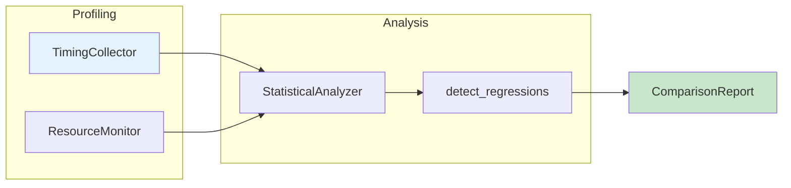
````

---

## 7. Framework Migration Guides

### Purpose

Many Calibrax users migrate from pytest-benchmark, ASV (Airspeed Velocity), or custom
benchmarking scripts. Each example should include "Coming from X?" sections that map
familiar concepts to Calibrax equivalents.

### Required Migration Sections

Each markdown documentation file should include comparison tables for relevant frameworks:

````markdown
## Coming from pytest-benchmark?

If you're familiar with pytest-benchmark, here's how Calibrax compares:

| pytest-benchmark | Calibrax |
|------------------|----------|
| `benchmark(func)` | `TimingCollector().measure_iteration(iterator, num_batches=N)` |
| `benchmark.stats["mean"]` | `StatisticalAnalyzer().analyze(samples).mean` |
| `--benchmark-compare` | `compare_configurations(run_a, run_b)` |
| `--benchmark-save=NAME` | `Store(path).save(run)` |
| `--benchmark-json=FILE` | `Store(path).save(run)` (JSON-per-run) |
| Auto-calibration | `TimingSample` with warmup separation |

**Key differences:**

1. **Direction-aware metrics**: Calibrax tracks whether higher or lower is better via `MetricDirection`
2. **Statistical rigor**: Bootstrap confidence intervals with outlier detection (MAD)
3. **JAX-native**: Handles JIT compilation warmup, async execution, device placement
4. **Regression detection**: Automatic baseline comparison with configurable thresholds

## Coming from ASV (Airspeed Velocity)?

| ASV | Calibrax |
|-----|----------|
| `asv run` | `calibrax ingest` (CLI) or `Store.save(run)` (API) |
| `asv compare` | `compare_configurations(run_a, run_b)` |
| `asv continuous` | `CIGuard(store).check(new_run)` |
| `asv publish` | `PublicationGenerator().generate_table(run)` |
| `benchmarks/` directory with classes | `BenchmarkProtocol` or `BenchmarkAdapter` |
| JSON results in `.asv/` | JSON-per-run in `benchmark-data/runs/` |
| Git-based tracking | `Run` metadata with commit, branch, timestamp |

**Key differences:**

1. **Not git-coupled**: Runs are standalone JSON files, not tied to git commits (though commit metadata is stored)
2. **Richer metadata**: `MetricDef` captures units, direction, priority, and grouping
3. **Statistical analysis**: Bootstrap CI, Welch's t-test, Mann-Whitney U, effect size
4. **Multi-objective**: Pareto front analysis across competing metrics

## Coming from Custom Scripts?

| Custom Approach | Calibrax |
|-----------------|----------|
| `time.time()` before/after | `TimingCollector` with warmup, JIT handling |
| Manual CSV logging | `Store` with JSON-per-run, baseline management |
| Eyeball comparison | `detect_regressions()` with statistical thresholds |
| Ad-hoc plotting | `PublicationGenerator` for LaTeX, HTML, CSV tables |
| Manual CI checks | `CIGuard` with `sys.exit(1)` on regression |
| `psutil.Process().memory_info()` | `ResourceMonitor` with daemon thread sampling |

**Key differences:**

1. **Structured data model**: `MetricDef` + `Metric` + `Point` + `Run` hierarchy
2. **Reproducibility**: Frozen dataclasses, deterministic serialization
3. **Composability**: Profilers, analyzers, and exporters work together seamlessly
````

### Framework Mapping Reference

Use this reference when creating migration sections:

#### Profiling & Timing

| Concept | pytest-benchmark | ASV | Custom | Calibrax |
|---------|------------------|-----|--------|----------|
| Timing | `benchmark(fn)` | `time_*` methods | `time.time()` | `TimingCollector.measure_iteration()` |
| Memory | Not built-in | `mem_*` methods | `psutil` | `ResourceMonitor` context manager |
| GPU memory | Not built-in | Not built-in | `pynvml` | `GPUMemoryProfiler` |
| FLOPs | Not built-in | Not built-in | Manual | `FlopsCounter` |
| Energy | Not built-in | Not built-in | `codecarbon` | `EnergyMonitor` |

#### Analysis & Comparison

| Concept | pytest-benchmark | ASV | Custom | Calibrax |
|---------|------------------|-----|--------|----------|
| Statistics | Min/max/mean/stddev | Mean/std | Manual | Bootstrap CI, outlier detection |
| Comparison | `--benchmark-compare` | `asv compare` | Eyeball | `compare_configurations()` |
| Regression | Not built-in | `asv continuous` | Manual | `detect_regressions()` |
| Ranking | Not built-in | Not built-in | Manual | `rank_table()`, `aggregate_score()` |
| Pareto | Not built-in | Not built-in | Manual | `pareto_front()` |

#### Storage & Export

| Concept | pytest-benchmark | ASV | Custom | Calibrax |
|---------|------------------|-----|--------|----------|
| Storage | JSON file | `.asv/results/` | CSV/JSON | `Store` (JSON-per-run) |
| Baseline | Manual | Git-based | Manual | `Store.set_baseline()` |
| W&B | Not built-in | Not built-in | Manual | `WandBExporter` |
| Publication | Not built-in | HTML pages | Manual | `PublicationGenerator` |
| CI gate | Not built-in | `asv continuous` | Manual | `CIGuard` |

### When to Include Migration Sections

| Example Category | pytest-benchmark? | ASV? | Custom Scripts? |
|------------------|-------------------|------|-----------------|
| Core Timing/Profiling | Yes | Yes | Yes |
| Statistical Analysis | Yes | No | Yes |
| Storage | Yes | Yes | Yes |
| Regression Detection | No | Yes | Yes |
| CI Integration | No | Yes | No |
| Export/Publication | No | Yes | No |
| Monitoring | No | No | Yes |

---

## 8. Content Principles

### The 7-Part Structure

Every Calibrax example follows this structure, adapted by tier:

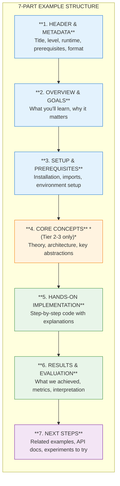

### Part 1: Header & Metadata

```markdown
# Benchmark Tutorial

| Metadata | Value |
|----------|-------|
| **Level** | Intermediate |
| **Runtime** | ~15 min (CPU) / ~10 min (GPU) |
| **Prerequisites** | Basic Python, JAX fundamentals |
| **Format** | Python + Jupyter |
| **Memory** | ~1 GB RAM |
```

**Metadata Fields**:

| Field | Required | Options/Format |
|-------|----------|----------------|
| Level | Yes | Beginner / Intermediate / Advanced |
| Runtime | Yes | ~X min (CPU) / ~Y min (GPU) |
| Prerequisites | Yes | Links to prior knowledge |
| Format | Yes | Python + Jupyter |
| Memory | Recommended | ~X GB RAM, ~Y GB VRAM |
| Devices | Optional | CPU / GPU / TPU |

### Part 2: Overview & Goals

```markdown
## Overview

This tutorial demonstrates the complete Calibrax benchmarking workflow: profiling
a JAX model, collecting structured metrics, storing results, and detecting
performance regressions against a baseline. You'll build a reusable benchmark
pipeline that integrates with CI/CD systems.

## Learning Goals

By the end of this example, you will be able to:

1. Profile a JAX function with `TimingCollector` and `ResourceMonitor`
2. Assemble metrics into `Point` and `Run` data structures
3. Store benchmark results and manage baselines with `Store`
4. Detect regressions with direction-aware threshold comparison
```

**Guidelines for Learning Goals**:

- Use action verbs: Create, Profile, Implement, Configure, Debug, Optimize, Detect, Compare
- Be specific and measurable
- Limit to 3-5 goals per example
- Tier 1: 2-3 goals, Tier 2: 4-5 goals, Tier 3: 4-6 goals

### Part 3: Setup & Prerequisites

````markdown
## Setup

### Quick Start

```bash
source activate.sh && python examples/metrics/05_composition.py
```

### Files

- **Python Script**: [`examples/metrics/05_composition.py`](https://github.com/avitai/calibrax/blob/main/examples/metrics/05_composition.py)
- **Jupyter Notebook**: [`examples/metrics/05_composition.ipynb`](https://github.com/avitai/calibrax/blob/main/examples/metrics/05_composition.ipynb)

### Imports

```python
# %%
# Standard library
import time
from pathlib import Path

# Third-party
import jax
import jax.numpy as jnp
from flax import nnx

# Calibrax
from calibrax.core import Metric, MetricDef, MetricDirection, Point, Run
from calibrax.profiling import TimingCollector, ResourceMonitor
from calibrax.statistics import StatisticalAnalyzer
from calibrax.analysis import detect_regressions
from calibrax.storage import Store
```
````

### Part 4: Core Concepts (Tier 2-3)

For tutorials and advanced guides, include theoretical background:

````markdown
## Core Concepts

### The Benchmarking Data Model

Calibrax uses a hierarchical data model where metrics flow through structured
containers:

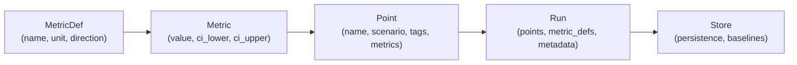

### Direction-Aware Metrics

| Direction | Meaning | Regression Condition | Example Metrics |
|-----------|---------|----------------------|-----------------|
| `HIGHER` | Max is better | Value dropped below threshold | Throughput, accuracy |
| `LOWER` | Min is better | Value rose above threshold | Latency, memory |
| `INFO` | No optimization semantics | Never flagged | Config string, version |

````

### Part 5: Hands-On Implementation

This is the main content section with step-by-step code:

````markdown
## Implementation

### Step 1: Define a Workload

Create a simple JAX function to benchmark.

```python
# %%
# Define a sample workload
def train_step(model, x, y):
    """Single training step for benchmarking."""
    def loss_fn(model):
        pred = model(x)
        return jnp.mean((pred - y) ** 2)

    loss, grads = nnx.value_and_grad(loss_fn)(model)
    return loss

# Create sample model and data
key = jax.random.PRNGKey(42)
x = jax.random.normal(key, (32, 784))
y = jax.random.normal(key, (32, 10))

print(f"Input shape: {x.shape}, Output shape: {y.shape}")
```

**Terminal Output:**
```
Input shape: (32, 784), Output shape: (32, 10)
```
````

### Part 6: Results & Evaluation

```markdown
## Results Summary

| Metric | Value | Notes |
|--------|-------|-------|
| Throughput | 2592 samples/sec | Average over 100 batches |
| Wall clock | 1.234 sec | Excluding JIT warmup |
| Peak memory | 1847 MB | RSS peak during profiling |
| Bootstrap CI | [1.180, 1.290] sec | 95% confidence interval |
| Regressions | 0 detected | Against stored baseline |

### What We Achieved

- Profiled a JAX model with proper warmup handling
- Computed bootstrap confidence intervals for timing measurements
- Stored results and established a baseline
- Ran regression detection with zero false positives

### Interpretation

The timing measurements show stable performance with a tight confidence
interval (< 10% relative width), indicating reproducible benchmarks.
The first batch time (0.847 sec) captures JIT compilation overhead,
which is automatically excluded from throughput calculations.
```

### Part 7: Next Steps

```markdown
## Next Steps

### Experiments to Try

1. **Increase batch size**: Try `batch_size=64` and observe throughput scaling
2. **Add GPU profiling**: Use `GPUMemoryProfiler` for device memory tracking
3. **Enable CI gates**: Wrap with `CIGuard` for automated regression detection

### Related Examples

| Example | Level | What You'll Learn |
|---------|-------|-------------------|
| [Statistics Quick Ref](../analysis/statistics-quickref.md) | Beginner | Bootstrap CI, outlier detection |
| [Regression Detection](../analysis/regression-detection.md) | Intermediate | Direction-aware regression analysis |
| [CI Integration Guide](../advanced/ci/ci-integration-guide.md) | Advanced | Production CI/CD pipeline |

### API Reference

- [`TimingCollector`](../../api-reference/profiling/timing.md) - Timing measurement
- [`ResourceMonitor`](../../api-reference/profiling/resources.md) - CPU/memory monitoring
- [`Store`](../../api-reference/storage.md) - JSON-per-run persistence
- [`detect_regressions()`](../../api-reference/analysis.md) - Regression detection
```

---

## 9. Visual Design System

### Design Tokens

Calibrax documentation uses Material for MkDocs with these design choices:

| Token | Value | Usage |
|-------|-------|-------|
| Primary Color | Blue | Headers, links, emphasis |
| Accent Color | Blue | Interactive elements, highlights |
| Code Font | Roboto Mono | All code blocks |
| Text Font | Roboto | Body text, headers |

### Callout Boxes

Use admonitions for different information types:

```markdown
!!! note "Key Concept"
    Direction-aware metrics mean Calibrax knows whether higher or lower
    values represent better performance for each metric.

!!! tip "Performance Tip"
    Use `jax.block_until_ready()` before timing measurements to ensure
    async GPU operations have completed.

!!! warning "Statistical Warning"
    Small sample sizes (< 30 measurements) produce wide confidence
    intervals. Increase `num_batches` for tighter estimates.

!!! danger "Breaking Change"
    In v0.2.0, `Store` requires explicit `Path` objects instead of strings.

!!! example "Try It"
    Modify the regression `threshold` from 0.05 to 0.01 and observe
    how sensitivity changes.

!!! info "Device Support"
    This example works on CPU, GPU, and TPU. GPU recommended for
    realistic throughput measurements.
```

### Calibrax-Specific Mermaid Templates

#### Benchmarking Pipeline

````markdown
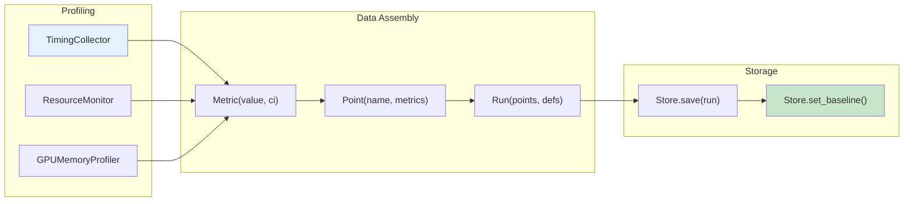
````

#### Regression Detection Flow

````markdown
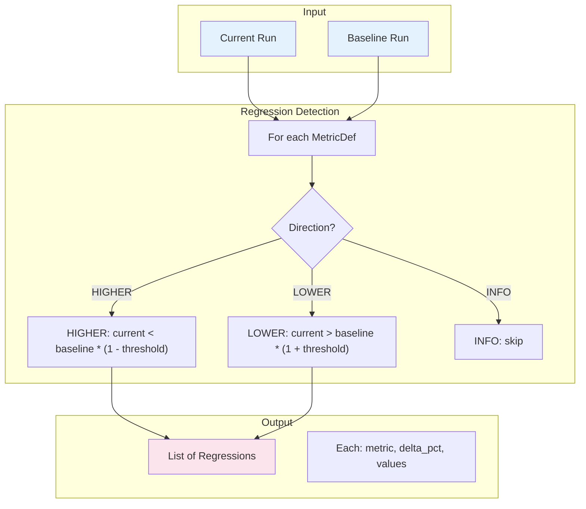
````

#### CI Integration Pipeline

````markdown
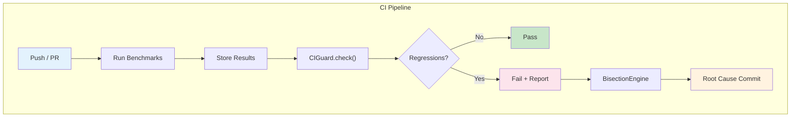
````

#### Storage Data Model

````markdown
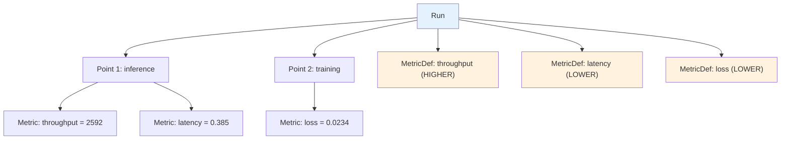
````

---

## 10. Documentation Tiers

### Tier 1: Quick Reference

#### Specification

| Attribute | Value |
|-----------|-------|
| **Target Audience** | Experienced developers needing quick syntax lookup |
| **Length** | 100-200 lines of code |
| **Time to Complete** | 5-10 minutes |
| **Code/Explanation Ratio** | 70% code / 30% explanation |
| **Prerequisites** | Working Calibrax knowledge |

#### Structure Template

````python
# ---
# jupyter:
#   jupytext:
#     formats: py:percent,ipynb
#     text_representation:
#       extension: .py
#       format_name: percent
#       format_version: '1.3'
# ---

# %% [markdown]
"""
# [Feature] Quick Reference

| Metadata | Value |
|----------|-------|
| **Level** | Beginner / Intermediate |
| **Runtime** | ~5 min |
| **Prerequisites** | [Basic Calibrax](link) |
| **Format** | Python + Jupyter |

## Overview

[1-2 sentences describing the feature]

## Learning Goals

1. [Goal 1]
2. [Goal 2]
3. [Goal 3]
"""

# %% [markdown]
"""
## Setup

```bash
source activate.sh
```
"""

# %%
# Imports
from calibrax.profiling import TimingCollector
# ... minimal imports

# %% [markdown]
"""
## Quick Start

[Brief explanation]
"""

# %%
# Core functionality - copy-paste ready
# ... working code with expected output comments

# %% [markdown]
"""
## Common Patterns

### Pattern 1: [Name]
"""

# %%
# Pattern implementation

# %% [markdown]
"""
## Results Summary

| Metric | Value |
|--------|-------|
| [Metric] | [Value] |

## Next Steps

- [Related example](link)
- [API Reference](link)
"""


# %%
def main():
    """CLI execution entry point."""
    # Complete example that can be run standalone
    pass


if __name__ == "__main__":
    main()
````

### Tier 2: Tutorial

#### Specification

| Attribute | Value |
|-----------|-------|
| **Target Audience** | First-time learners of a feature |
| **Length** | 300-600 lines |
| **Time to Complete** | 30-60 minutes |
| **Code/Explanation Ratio** | 50% code / 50% explanation |
| **Prerequisites** | Basic Calibrax, relevant domain knowledge |

#### Structure Template

````python
# ---
# jupyter:
#   jupytext:
#     formats: py:percent,ipynb
#     text_representation:
#       extension: .py
#       format_name: percent
#       format_version: '1.3'
# ---

# %% [markdown]
"""
# [Feature] Tutorial

| Metadata | Value |
|----------|-------|
| **Level** | Intermediate |
| **Runtime** | ~30 min |
| **Prerequisites** | [Prerequisite 1](link), [Prerequisite 2](link) |
| **Format** | Python + Jupyter |
| **Memory** | ~2 GB RAM |

## Overview

[2-3 paragraphs explaining what this tutorial covers and why it matters]

## Learning Goals

1. [Conceptual goal - Understand X]
2. [Practical goal - Implement Y]
3. [Practical goal - Configure Z]
4. [Applied goal - Detect/Optimize W]
"""

# %% [markdown]
"""
## Prerequisites

### Required Knowledge

- [Prerequisite 1](link) - Brief description
- [Prerequisite 2](link) - Brief description

### Quick Start

```bash
source activate.sh && python examples/path/to/example.py
```

### Environment Setup

[Any environment variables, device configuration, etc.]
"""

# %%
# Imports - organized by category
from pathlib import Path

import jax
import jax.numpy as jnp
from flax import nnx

# Calibrax imports
from calibrax.core import Metric, MetricDef, MetricDirection, Point, Run
from calibrax.profiling import TimingCollector, ResourceMonitor
from calibrax.storage import Store

# %% [markdown]
"""
## Core Concepts

### Concept 1: [Name]

[Detailed explanation with theory]

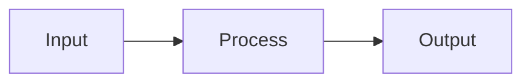

### Concept 2: [Name]

[Explanation with examples]

| Type | Description | Use Case |
|------|-------------|----------|
| Type A | ... | ... |
| Type B | ... | ... |
"""

# %% [markdown]
"""
## Implementation

### Part 1: [First Major Section]

[Explanation of what this section builds and why]
"""

# %%
# Part 1 implementation
# ... code with inline comments

# %% [markdown]
"""
### Part 2: [Second Major Section]

[Explanation connecting to Part 1]
"""

# %%
# Part 2 implementation

# %% [markdown]
"""
## Troubleshooting

### Common Issue 1: [Error/Problem]

**Symptom**: [What the user sees]

**Cause**: [Why it happens]

**Solution**:
```python
# Fixed code
```
"""

# %% [markdown]
"""
## Results & Evaluation

### What We Achieved

[Summary of completed work]

### Key Metrics

| Metric | Value | Notes |
|--------|-------|-------|
| [Metric 1] | [Value] | [Context] |
| [Metric 2] | [Value] | [Context] |

### Interpretation

[What the results mean for real-world usage]
"""

# %% [markdown]
"""
## Next Steps

### Experiments to Try

1. [Experiment 1] - [Expected outcome]
2. [Experiment 2] - [Expected outcome]

### Related Tutorials

- [Tutorial Name](link) - [Brief description]

### API Reference

- [`ClassName`](link) - [Purpose]
- [`function_name()`](link) - [Purpose]
"""


# %%
def main():
    """Complete tutorial as a runnable script."""
    print("Running [Feature] Tutorial...")

    # Complete implementation combining all parts

    print("Tutorial completed successfully!")


if __name__ == "__main__":
    main()
````

### Tier 3: Advanced Guide

#### Specification

| Attribute | Value |
|-----------|-------|
| **Target Audience** | Production engineers, expert users |
| **Length** | 500-1000+ lines |
| **Time to Complete** | 60+ minutes |
| **Code/Explanation Ratio** | 40% code / 60% explanation |
| **Prerequisites** | Complete Tier 2 tutorials, production experience |

#### Structure Template

````python
# ---
# jupyter:
#   jupytext:
#     formats: py:percent,ipynb
#     text_representation:
#       extension: .py
#       format_name: percent
#       format_version: '1.3'
# ---

# %% [markdown]
"""
# [Advanced Topic] Guide

| Metadata | Value |
|----------|-------|
| **Level** | Advanced |
| **Runtime** | ~60+ min |
| **Prerequisites** | [Tutorial 1](link), [Tutorial 2](link), Production experience |
| **Format** | Python + Jupyter |
| **Memory** | ~4 GB RAM, ~8 GB VRAM recommended |
| **Devices** | GPU/TPU recommended |

## Overview

[Thorough overview including:
- What problem it solves
- When to use it (and when not to)
- Performance implications
- Production considerations]

## Learning Goals

1. [Architecture goal - Design X for production]
2. [Implementation goal - Build Y with proper error handling]
3. [Optimization goal - Tune Z for performance]
4. [Debugging goal - Diagnose and fix common issues]
5. [Integration goal - Combine with existing systems]
"""

# %% [markdown]
"""
## Architecture Overview

### System Design

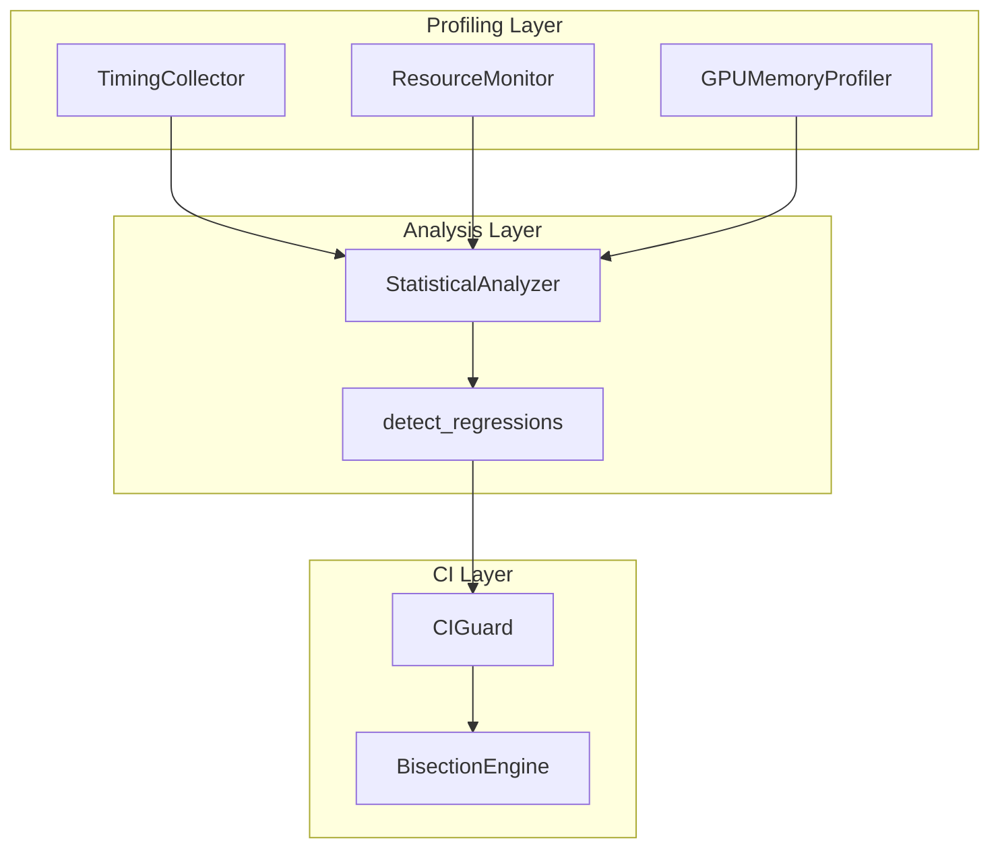
"""

# %% Implementation, Performance, Troubleshooting sections follow...
````

---

## 11. Component Library

### Reusable Documentation Components

These templates can be copied and adapted for new examples.

### Setup Section Template

````python
# %% [markdown]
"""
## Setup

### Quick Start

```bash
source activate.sh && python examples/path/to/example.py
```

### Files

- **Python Script**: [`examples/path/to/example.py`](https://github.com/avitai/calibrax/blob/main/examples/path/to/example.py)
- **Jupyter Notebook**: [`examples/path/to/example.ipynb`](https://github.com/avitai/calibrax/blob/main/examples/path/to/example.ipynb)
"""

# %%
# Imports - organized by source

# Standard library
import time
from pathlib import Path

# Third-party
import jax
import jax.numpy as jnp
from flax import nnx

# Calibrax
from calibrax.core import Metric, MetricDef, MetricDirection, Point, Run
from calibrax.profiling import TimingCollector, ResourceMonitor
from calibrax.statistics import StatisticalAnalyzer
from calibrax.storage import Store

# Verify setup
print(f"JAX version: {jax.__version__}")
print(f"Devices: {jax.devices()}")
````

### Workload Creation Template

```python
# %% [markdown]
"""
### Creating a Sample Workload

Calibrax benchmarks any callable. Here we create a simple JAX training step.
"""

# %%
def create_sample_workload(batch_size: int = 32, input_dim: int = 784):
    """Create a sample JAX workload for benchmarking.

    Args:
        batch_size: Number of samples per batch.
        input_dim: Input feature dimension.

    Returns:
        Tuple of (model, train_step_fn, sample_batch).
    """
    model = nnx.Linear(input_dim, 10, rngs=nnx.Rngs(42))

    @jax.jit
    def train_step(model, x):
        return model(x)

    key = jax.random.PRNGKey(0)
    x = jax.random.normal(key, (batch_size, input_dim))

    return model, train_step, x

model, train_step, x = create_sample_workload()
print(f"Workload created: batch_size=32, input_dim=784")
# Expected output:
# Workload created: batch_size=32, input_dim=784
```

### Run Assembly Template

```python
# %% [markdown]
"""
### Assembling a Benchmark Run

Combine metrics, points, and metadata into a structured `Run`.
"""

# %%
from calibrax.core import Metric, MetricDef, MetricDirection, MetricPriority, Point, Run

# Define metric semantics
metric_defs = {
    "throughput": MetricDef(
        name="throughput",
        unit="samples/sec",
        direction=MetricDirection.HIGHER,
        priority=MetricPriority.PRIMARY,
        description="Training throughput",
    ),
    "latency": MetricDef(
        name="latency",
        unit="sec",
        direction=MetricDirection.LOWER,
        priority=MetricPriority.PRIMARY,
        description="Per-batch latency",
    ),
    "peak_memory": MetricDef(
        name="peak_memory",
        unit="MB",
        direction=MetricDirection.LOWER,
        priority=MetricPriority.SECONDARY,
        description="Peak RSS memory",
    ),
}

# Create a point with measured metrics
point = Point(
    name="inference",
    scenario="default",
    tags={"framework": "jax", "model": "linear"},
    metrics={
        "throughput": Metric(value=2592.0),
        "latency": Metric(value=0.385),
        "peak_memory": Metric(value=1847.0),
    },
)

# Assemble run with metadata
run = Run(
    points=(point,),
    metric_defs=metric_defs,
)
print(f"Run created: {len(run.points)} points, {len(run.metric_defs)} metrics")
# Expected output:
# Run created: 1 points, 3 metrics
```

### Troubleshooting Template

````markdown
## Troubleshooting

### Error: Unstable timing measurements

**Symptom**: Large variance in timing results, wide confidence intervals.

**Cause**: JIT compilation warmup not properly excluded, or system load
interference.

**Solution**:
```python
# doctest: +SKIP — template
# Increase warmup iterations
collector = TimingCollector()
sample = collector.measure_iteration(
    iterator,
    num_batches=200,       # More samples
    count_fn=count_fn,
)

# Check stability
analyzer = StatisticalAnalyzer()
result = analyzer.summarize(sample.per_batch_times)
print(f"CV: {result.cv:.3f}")  # Should be < 0.10
print(f"Stable: {result.is_stable}")
```

**Prevention**: Always use `jax.block_until_ready()` and allow sufficient
warmup for JIT compilation.

### Error: `RESOURCE_EXHAUSTED` during GPU profiling

**Symptom**: GPU memory profiler crashes with out-of-memory error.

**Cause**: Model or batch size exceeds available GPU memory.

**Solution**:
```python
# doctest: +SKIP — template
# Reduce batch size
x = jax.random.normal(key, (8, 784))  # Was (32, 784)

# Or profile with smaller model
model = nnx.Linear(784, 10, rngs=nnx.Rngs(42))
```
````

### Results Summary Template

```markdown
## Results Summary

### What We Achieved

| Metric | Value | Notes |
|--------|-------|-------|
| Throughput | 2592 samples/sec | Average over 100 batches |
| Latency | 0.385 sec/batch | Excluding JIT warmup |
| Peak memory | 1847 MB | RSS peak |
| 95% CI width | 0.110 sec | Bootstrap, 10000 resamples |
| Stability | CV = 0.042 | Below 0.10 threshold |

### Interpretation

[What the results mean for real-world usage]
```

### Next Steps Template

```markdown
## Next Steps

### Experiments to Try

1. **GPU profiling**: Add `GPUMemoryProfiler` for device memory tracking
2. **Statistical rigor**: Increase samples and compare CI widths
3. **Regression detection**: Store a baseline and run `detect_regressions()`

### Related Examples

| Example | Level | What You'll Learn |
|---------|-------|-------------------|
| [Statistics Quick Ref](link) | Beginner | Bootstrap CI, outlier detection |
| [Comparison Tutorial](link) | Intermediate | Cross-configuration analysis |
| [CI Integration Guide](link) | Advanced | Production regression gates |

### API Reference

- [`TimingCollector`](../../api-reference/profiling/timing.md) - Timing measurement
- [`ResourceMonitor`](../../api-reference/profiling/resources.md) - CPU/memory monitoring
- [`Store`](../../api-reference/storage.md) - Persistence and baselines

### External Resources

- [JAX Documentation](https://jax.readthedocs.io/) - JAX fundamentals
- [Flax NNX Guide](https://flax.readthedocs.io/) - NNX patterns
```

---

## 12. Writing Guidelines

### Voice and Tone

#### Educational

Write to teach, not to impress. Assume intelligence but not prior knowledge.

```markdown
<!-- Good -->
Bootstrap confidence intervals resample your measurements to estimate
uncertainty. With 30+ samples, the interval width stabilizes and gives
you reliable bounds on the true performance.

<!-- Avoid -->
The bootstrap estimator leverages the plug-in principle to construct
non-parametric confidence regions via empirical distribution resampling.
```

#### Encouraging

Acknowledge difficulty while providing clear paths forward.

```markdown
<!-- Good -->
Regression detection can surface false positives when benchmarks are noisy.
Let's start with a generous threshold (10%) and tighten it as measurements
stabilize.

<!-- Avoid -->
This is trivial for anyone familiar with hypothesis testing.
```

#### Specific

Provide concrete numbers, not vague descriptions.

```markdown
<!-- Good -->
- Runtime: ~5 min on CPU, ~2 min on GPU
- Memory: ~1 GB RAM, ~2 GB VRAM
- Throughput: ~2500 samples/sec on A100
- CI width: ~0.11 sec (95% bootstrap, 10000 resamples)

<!-- Avoid -->
- This runs quickly
- Requires moderate memory
- High throughput
```

#### Active Voice

Use active voice for clearer instructions.

```markdown
<!-- Good -->
Create a TimingCollector to measure iteration throughput.
The analyzer computes bootstrap confidence intervals.

<!-- Avoid -->
A TimingCollector should be created for throughput measurement.
Bootstrap confidence intervals are computed by the analyzer.
```

### Grammar and Style

| Rule | Example |
|------|---------|
| Capitalize proper nouns | "Calibrax", "JAX", "Flax NNX" |
| Use code formatting for code | "`TimingCollector`", "`detect_regressions()`" |
| Use present tense | "The monitor tracks" not "will track" |

### Technical Terms

#### Calibrax-Specific Terminology

| Term | Definition | Usage |
|------|------------|-------|
| Run | Collection of benchmark measurements | "Save the run to the store" |
| Point | Single benchmark scenario measurement | "Create a point for each configuration" |
| Metric | Individual measured value with optional CI | "The throughput metric has value 2592" |
| MetricDef | Semantic definition of a metric | "Define direction as HIGHER for throughput" |
| Direction | Whether higher or lower is better | "LOWER direction means regression = value increased" |
| Baseline | Reference run for regression comparison | "Set the main branch run as baseline" |
| Regression | Performance degradation vs baseline | "Detected 2 regressions above 5% threshold" |
| Bootstrap CI | Non-parametric confidence interval | "95% CI via 10000 bootstrap resamples" |
| Store | JSON-per-run persistence backend | "Save runs and manage baselines with Store" |
| CIGuard | CI regression gate with exit codes | "CIGuard fails the build on regression" |
| Adapter | Bridge between model and benchmark protocol | "Wrap NNX models with NNXBenchmarkAdapter" |
| Pareto front | Non-dominated solutions in multi-objective space | "Find Pareto-optimal configurations" |

#### Code Comment Standards

```python
# doctest: +SKIP — template
# Good: Explain WHY, not WHAT
# Use 100 batches to get a stable throughput estimate
# (below 30 produces wide CI, above 200 shows diminishing returns)
num_batches = 100

# Good: Note non-obvious behavior
# First batch includes JIT compilation time and is excluded from throughput
sample = collector.measure_iteration(iterator, num_batches=100)

# Good: Reference direction semantics
# LOWER direction: regression = value INCREASED above threshold
latency_def = MetricDef(name="latency", unit="sec", direction=MetricDirection.LOWER)

# Avoid: Redundant comments
# Create a timing collector
collector = TimingCollector()  # This is obvious
```

---

## 13. Code Example Standards

### Executable Code Philosophy

**All code in Calibrax examples must be executable.**

- No pseudocode or placeholder syntax
- All imports must be real and available
- Expected outputs must match actual execution
- Examples should work on both CPU and GPU

### JAX-Idiomatic Patterns

Calibrax examples should follow JAX best practices:

```python
# doctest: +SKIP — template
# Explicit PRNG (never use global random state)
key = jax.random.PRNGKey(42)
k1, k2 = jax.random.split(key)

# Block until ready for accurate timing (JAX is async)
result = model(x)
result.block_until_ready()
elapsed = time.perf_counter() - start

# Frozen dataclasses for immutable data
from calibrax.core import Metric, Point, Run  # All frozen=True

# Context managers for resource management
with ResourceMonitor(sample_interval_sec=0.1) as monitor:
    train(model, data)
summary = monitor.summary  # Auto-cleanup via __exit__
```

### Code Organization Patterns

#### Import Organization

```python
# doctest: +SKIP — template
# Standard library (alphabetical)
import time
from pathlib import Path

# Third-party (alphabetical)
import jax
import jax.numpy as jnp
from flax import nnx

# Calibrax core
from calibrax.core import Metric, MetricDef, MetricDirection, Point, Run

# Calibrax submodules (alphabetical)
from calibrax.analysis import detect_regressions, compare_configurations
from calibrax.profiling import TimingCollector, ResourceMonitor
from calibrax.statistics import StatisticalAnalyzer
from calibrax.storage import Store
```

#### Function Documentation

```python
# doctest: +SKIP — template
def benchmark_model(
    model: nnx.Module,
    data_iterator: Iterator,
    num_batches: int = 100,
) -> dict[str, float]:
    """Benchmark a JAX model and return structured metrics.

    Args:
        model: Flax NNX model to benchmark.
        data_iterator: Iterator yielding batches.
        num_batches: Number of batches to measure.

    Returns:
        Dictionary with 'throughput', 'latency', and 'peak_memory' keys.

    Example:
        >>> metrics = benchmark_model(model, train_iter, num_batches=50)
        >>> metrics['throughput']
        2592.0
    """
    collector = TimingCollector()
    with ResourceMonitor() as monitor:
        sample = collector.measure_iteration(data_iterator, num_batches)

    return {
        "throughput": sample.num_elements / sample.wall_clock_sec,
        "latency": sample.wall_clock_sec / num_batches,
        "peak_memory": monitor.summary.peak_rss_mb,
    }
```

### Visualization Code Standards

When creating visualizations for benchmark results:

```python
# doctest: +SKIP — template
# %% [markdown]
"""
## Visualizing Benchmark Results

Compare throughput across configurations.
"""

# %%
import matplotlib.pyplot as plt

def plot_regression_comparison(current_run, baseline_run, save_path):
    """Plot current vs baseline metrics side by side.

    Args:
        current_run: Current benchmark run.
        baseline_run: Baseline run for comparison.
        save_path: Path to save the figure.
    """
    metric_names = list(current_run.metric_defs.keys())
    current_values = [
        current_run.points[0].metrics[m].value for m in metric_names
    ]
    baseline_values = [
        baseline_run.points[0].metrics[m].value for m in metric_names
    ]

    fig, ax = plt.subplots(figsize=(10, 6))
    x = range(len(metric_names))
    width = 0.35
    ax.bar([i - width/2 for i in x], baseline_values, width, label="Baseline")
    ax.bar([i + width/2 for i in x], current_values, width, label="Current")
    ax.set_xticks(x)
    ax.set_xticklabels(metric_names)
    ax.legend()
    ax.set_title("Baseline vs Current")
    plt.tight_layout()
    plt.savefig(save_path, dpi=150, bbox_inches='tight')
    plt.close()

plot_regression_comparison(
    current_run=current_run,
    baseline_run=baseline_run,
    save_path='docs/assets/examples/regression_detection/comparison.png',
)
print("Saved regression comparison plot")
```

---

## 14. Implementation Workflow

### Four-Phase Development Process

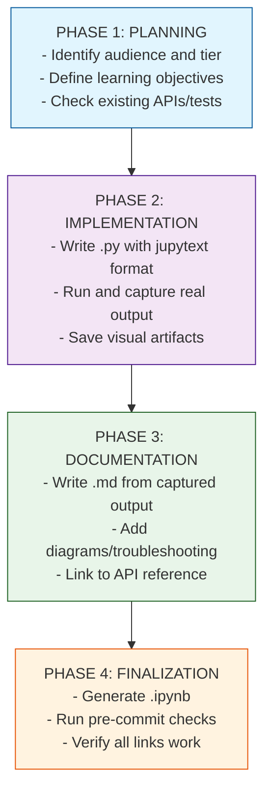

### Phase 1: Planning

Before writing any code, answer these questions:

1. **Who is the audience?**
    - [ ] First-time Calibrax user
    - [ ] Developer familiar with benchmarking basics
    - [ ] CI/CD engineer
    - [ ] Researcher comparing model configurations

2. **What tier is appropriate?**
    - [ ] Tier 1: Quick Reference (single concept, <10 min)
    - [ ] Tier 2: Tutorial (guided learning, 30-60 min)
    - [ ] Tier 3: Advanced Guide (production, 60+ min)

3. **What APIs and patterns exist?**
    - Check `src/calibrax/` for relevant classes and functions
    - Review existing tests in `tests/` for API usage patterns
    - Consult `docs/user-guide/` for existing coverage

4. **What are the learning objectives?**
    - List 3-5 specific, measurable outcomes
    - Use action verbs: Create, Profile, Configure, Detect, Compare, Debug, Optimize

### Phase 2: Implementation (Code First)

**Write and run the Python file before writing documentation.**

1. **Create the .py file with jupytext format**

    ```python
    # ---
    # jupyter:
    #   jupytext:
    #     text_representation:
    #       extension: .py
    #       format_name: percent
    #       format_version: '1.3'
    #       jupytext_version: 1.16.4
    #   kernelspec:
    #     display_name: Python 3 (ipykernel)
    #     language: python
    #     name: python3
    # ---
    ```

2. **Structure the code with markdown cells**
    - Title and overview in first markdown cell
    - Use `# %%` for code cells, `# %% [markdown]` for markdown cells
    - Avoid `print("\n" + ...)` - jupytext splits escape sequences

3. **Save visual artifacts to the correct location**
    - Directory: `docs/assets/examples/<example_name>/` (NOT `*_files/`)
    - Example: `docs/assets/examples/benchmark_tutorial/timing_trend.png`

4. **Run the example and capture real output**

    ```bash
    source activate.sh && python examples/<path>/<example>.py
    ```

    - **CRITICAL**: All "Terminal Output" in documentation MUST be from actual execution
    - Do NOT invent or guess output - run the code and capture what it produces
    - If the example fails, fix the code or underlying APIs before proceeding

5. **Verify results are sensible**
    - Check timing values are in expected range
    - Ensure confidence intervals have reasonable width
    - Confirm regression detection produces correct results

### Phase 3: Documentation (From Real Output)

1. **Write the .md file using captured terminal output**
    - Every `**Terminal Output:**` section must contain actual output from Phase 2
    - Copy-paste from terminal, do not paraphrase or abbreviate
    - Include timing information if relevant

2. **Follow the required section order**
    1. Title (`# Example Name`)
    2. Metadata table (Level, Runtime, Prerequisites, Format, Memory)
    3. Overview (2-3 paragraphs)
    4. What You'll Learn (numbered list with action verbs)
    5. Coming from X? (migration table for pytest-benchmark/ASV users)
    6. Files (links to .py and .ipynb)
    7. Quick Start (bash commands)
    8. Core Concepts (theory with Mermaid diagrams)
    9. Implementation (Step 1, Step 2, etc. with Terminal Output)
    10. Visualization (images from `docs/assets/examples/`)
    11. Results Summary (metrics table)
    12. Next Steps (Experiments, Related Examples, API Reference, Troubleshooting)

3. **Add Troubleshooting section**
    - Include 2-3 common issues users might encounter
    - Format: Symptom -> Cause -> Solution with code example

### Phase 4: Finalization

1. **Run pre-commit checks**

    ```bash
    uv run pre-commit run --files examples/<path>/<example>.py
    ```

    - Fix any linting/formatting issues

2. **Generate the Jupyter notebook**

    ```bash
    python scripts/jupytext_converter.py py-to-nb examples/<path>/<example>.py
    ```

    - Do NOT use raw jupytext - use the converter script

3. **Verify documentation links**

    ```bash
    mkdocs build --strict
    ```

    - Fix any broken internal links

4. **Update mkdocs.yml navigation**
    - Add the new example to the appropriate category
    - Ensure nav path matches file location

---

## 15. Quality Checklist

### Pre-Submission Checklist

Use this checklist before submitting new examples or updates.

#### Python File (.py)

- [ ] Jupytext YAML header present (9-line format)
- [ ] First markdown cell has title, metadata table, overview, learning goals
- [ ] All markdown cells use triple-quoted `"""` style (not `#`-comments)
- [ ] Expected output comments after key print statements
- [ ] Artifacts saved to `docs/assets/examples/<name>/` (NOT `*_files/`)
- [ ] Results Summary + Next Steps markdown cells near end
- [ ] `main()` function and `if __name__ == "__main__": main()` at bottom
- [ ] No `\n` in string concatenation (use `print()` + `print(...)` instead)

#### Markdown File (.md)

- [ ] Metadata table (Level, Runtime, Prerequisites, Format, Memory)
- [ ] Overview + What You'll Learn section
- [ ] Files section with GitHub links
- [ ] Quick Start with `source activate.sh && python ...`
- [ ] Framework comparison (where applicable, see Section 7)
- [ ] Step-by-step implementation with Terminal Output blocks
- [ ] Mermaid architecture diagram (where applicable)
- [ ] Visualizations referencing PNGs in `docs/assets/examples/`
- [ ] Results Summary table with metrics
- [ ] Next Steps + Related Examples + API Reference + Troubleshooting

#### Notebook File (.ipynb)

- [ ] Generated from .py via `scripts/jupytext_converter.py`
- [ ] Opens and renders correctly in Jupyter

#### Content Quality

- [ ] All code executes without errors
- [ ] Imports are organized and all used
- [ ] Variables have descriptive names
- [ ] Functions have docstrings
- [ ] Expected outputs match actual execution
- [ ] Technical terms defined or linked
- [ ] Learning objectives are specific and measurable (action verbs)
- [ ] Random seeds set for reproducibility

#### Visual Quality

- [ ] Markdown cells properly formatted
- [ ] Code blocks have syntax highlighting
- [ ] Tables are properly aligned
- [ ] Diagrams are clear and readable
- [ ] No walls of text

#### Navigation

- [ ] mkdocs.yml nav entry exists
- [ ] Internal links to other examples work
- [ ] Links to API documentation work
- [ ] External resource links work

---

## 16. Examples Demonstrating Principles

### Progressive Disclosure Example

This shows how to structure information from simple to complex:

```python
# doctest: +SKIP — template
# %% [markdown]
"""
## Benchmarking a Model: Three Levels

### Level 1: Minimal Timing (Copy-Paste Ready)
"""

# %%
# Just 4 lines to get started
from calibrax.profiling import TimingCollector

collector = TimingCollector()
sample = collector.measure_iteration(data_iterator, num_batches=100)
print(f"Wall clock: {sample.wall_clock_sec:.3f} sec ({sample.num_batches} batches)")
# Expected output:
# Wall clock: 1.234 sec (100 batches)

# %% [markdown]
"""
### Level 2: Adding Statistical Analysis (Building Complexity)
"""

# %%
# Add bootstrap confidence intervals
from calibrax.statistics import StatisticalAnalyzer

analyzer = StatisticalAnalyzer()
result = analyzer.summarize(sample.per_batch_times)
print(f"Mean: {result.mean:.4f} sec")
print(f"95% CI: [{result.ci_lower:.4f}, {result.ci_upper:.4f}]")
print(f"Stable: {result.is_stable}")

# %% [markdown]
"""
### Level 3: Full Pipeline with Storage and Regression Detection (Production)
"""

# %%
# Store, baseline, and regression detection
# ... (shown in benchmark tutorial)
```

### Learning by Doing Example

Every concept is followed immediately by runnable code:

```python
# doctest: +SKIP — template
# %% [markdown]
"""
## Direction-Aware Regression Detection

Calibrax uses metric direction to determine whether a change is a regression.
For `HIGHER` metrics (throughput), a decrease is bad. For `LOWER` metrics
(latency), an increase is bad.

**Key Concept**: The `MetricDirection` enum on each `MetricDef` is the single
source of truth for how to interpret value changes.
"""

# %%
# Immediately apply the concept
from calibrax.core import MetricDef, MetricDirection

throughput_def = MetricDef(
    name="throughput",
    unit="samples/sec",
    direction=MetricDirection.HIGHER,  # Decrease = regression
)

latency_def = MetricDef(
    name="latency",
    unit="sec",
    direction=MetricDirection.LOWER,  # Increase = regression
)

print(f"Throughput direction: {throughput_def.direction}")
print(f"Latency direction: {latency_def.direction}")
# Expected output:
# Throughput direction: higher
# Latency direction: lower
```

### Show Expected Outputs Example

All code shows what users will see:

```python
# doctest: +SKIP — template
# %%
# Detect regressions
from calibrax.analysis import detect_regressions

regressions = detect_regressions(current_run, baseline_run, threshold=0.05)

print(f"Regressions detected: {len(regressions)}")
for r in regressions:
    print(f"  {r.metric}: {r.baseline_value:.1f} -> {r.current_value:.1f} ({r.delta_pct:+.1f}%)")

# Expected output:
# Regressions detected: 1
#   throughput: 2800.0 -> 2592.0 (-7.4%)
```

---

## 17. Maintenance & Updates

### Review Schedule

| Review Type | Frequency | Scope |
|-------------|-----------|-------|
| Link check | Weekly (automated) | All internal/external links |
| Example execution | Monthly | Run all examples, verify outputs |
| Content review | Quarterly | Update for API changes |
| Competitor comparison update | Quarterly | Update framework migration tables |
| Full audit | Annually | Full restructure if needed |

### Version History Tracking

Each example should include a version comment:

```python
# %% [markdown]
"""
# Benchmark Tutorial

...

---

**Version History**:

- v1.0 (2026-03): Initial release with core benchmarking workflow
"""
```

### Handling Breaking Changes

When Calibrax APIs change:

1. **Update all affected examples** before release
2. **Add migration notes** to examples
3. **Update troubleshooting** for common upgrade issues
4. **Test both old and new patterns** during transition

```markdown
!!! warning "API Change in v0.2.0"
    `Store` now requires `Path` objects instead of strings.

    **Before (v0.1.x)**:
    ```python
    store = Store("benchmark-data")
    ```

    **After (v0.2.0+)**:
    ```python
    store = Store(Path("benchmark-data"))
    ```
```

### Updating Competitor Comparisons

When new versions of competitors release, update the framework migration tables in Section 7.
Monitor releases of:

- pytest-benchmark
- ASV (Airspeed Velocity)
- Google Benchmark (C++ but often referenced)
- MLPerf (methodology reference)

### Community Contributions

#### Accepting Example Contributions

1. Contributor opens PR with new example
2. Review against quality checklist (Section 15)
3. Request changes if needed
4. Merge when all checks pass
5. Add contributor to acknowledgments

#### Example Contribution Template

Contributors should use the template at [`examples/_templates/example_template.py`](https://github.com/avitai/calibrax/blob/main/examples/_templates/example_template.py)
as a starting point for new examples.

---

## 18. Metrics Module Documentation Patterns

The metrics module (`calibrax.metrics`) is the largest single module expansion in calibrax,
adding 110+ registered metrics across 4 computational tiers and 17 functional domains. This
section establishes documentation patterns specific to the metrics module.

### 18.1 Metrics Documentation Architecture

The metrics module documentation is organized into three layers:

| Layer | Location | Content | Generation |
|-------|----------|---------|------------|
| **API Reference** | `docs/api-reference/metrics/` | Per-module function/class docs | Auto-generated via mkdocstrings from source docstrings |
| **User Guides** | `docs/user-guide/` | Conceptual guides for metric categories | Manual, with embedded code examples |
| **Examples** | `examples/metrics/` + `docs/examples/metrics/` | Runnable tutorials with documentation pages | Dual-format (Python + Jupyter via Jupytext) |

### 18.2 Metrics API Reference Pages

Each functional module gets its own API reference page under `docs/api-reference/metrics/`.
Pages are auto-generated from docstrings using mkdocstrings.

**Standard mkdocstrings page template:**

```markdown
# Regression Metrics

::: calibrax.metrics.functional.regression
    options:
      show_source: false
      show_root_heading: false
      members_order: source
      docstring_style: google
      show_signature_annotations: true
```

**API reference page requirements:**

- Module-level docstring summarizing purpose, tier, and domain
- All public functions/classes rendered via mkdocstrings
- Cross-links to related modules (e.g., distance.md links to divergence.md and geometric.md)
- "See Also" section linking to the relevant user guide and examples

### 18.3 Metrics Docstring Standards

Every public metric function must include these elements in its Google-style docstring:

```python
def poincare_distance(a: Any, b: Any) -> Any:
    """Poincaré disk model distance for hyperbolic geometry.

    Computes geodesic distance in the Poincaré disk model of hyperbolic
    space: d(a, b) = arccosh(1 + 2‖a-b‖² / ((1-‖a‖²)(1-‖b‖²))).

    Suitable for hierarchical data embeddings where tree-like structures
    map naturally to hyperbolic space (negative curvature).

    Args:
        a: Point(s) in the Poincaré disk (‖a‖ < 1).
        b: Point(s) in the Poincaré disk (‖b‖ < 1).

    Returns:
        Hyperbolic distance as a scalar value. Non-negative.
        For batches (2D arrays): mean distance across rows.

    Raises:
        ValueError: If shapes do not match.
        ValueError: If any point has norm ≥ 1 (outside the disk).

    Example:
        >>> import jax.numpy as jnp
        >>> from calibrax.metrics.functional.distance import poincare_distance
        >>> a = jnp.array([0.0, 0.0])  # origin
        >>> b = jnp.array([0.5, 0.0])  # halfway to boundary
        >>> poincare_distance(a, b)  # arccosh(1 + 2*0.25/0.75) ≈ 1.0986
        1.0986...

    Note:
        - Direction: LOWER (smaller distance = more similar)
        - Geometry: Hyperbolic (negative curvature, Poincaré disk model)
        - Invariances: Möbius transformations (isometries of the disk)
        - True metric: Yes (satisfies identity, symmetry, triangle inequality)
        - Estimation: Exact computation, no sampling required
        - Related: ``lorentz_distance`` (equivalent via Lorentz hyperboloid model)
    """
```

**Required docstring elements for metric functions:**

| Element | Purpose | Example |
|---------|---------|---------|
| Summary line | One-line description | "Poincaré disk model distance for hyperbolic geometry." |
| Mathematical formula | LaTeX-free formula in docstring | "d(a, b) = arccosh(1 + 2‖a-b‖² / ...)" |
| When to use | Application context | "Suitable for hierarchical data embeddings" |
| Args | Parameter descriptions | "a: Point(s) in the Poincaré disk (‖a‖ < 1)." |
| Returns | Return value with range | "Non-negative. For batches: mean across rows." |
| Raises | Error conditions | "ValueError: If any point has norm ≥ 1" |
| Example | Runnable doctest | `>>> poincare_distance(a, b)` |
| Note | Metric properties | Direction, geometry, invariances, axiom compliance |

### 18.4 Metrics User Guide Patterns

User guides for the metrics module explain **when and why** to use metric categories,
not just **how**. They should bridge mathematical theory and practical usage.

**Required user guides:**

| Guide | Scope | Key Content |
|-------|-------|-------------|
| `metrics-overview.md` | Sprint 1 | 4-tier system, MetricRegistry, choosing metrics by axiom/invariance |
| `geometric-metrics.md` | Sprint 3 | Geometric hierarchy, curvature matching, distance vs. divergence |
| `metric-composition.md` | Sprint 5 | MetricCollection, WeightedMetric, wrappers, CI gate patterns |
| `stateful-metrics.md` | Sprint 7, 9 | Frozen backbone → learned → metric learning progression |
| `metrics-migration.md` | Sprint 10 | From artifex/opifex/custom to calibrax patterns |

**User guide structure template:**

```markdown
# Choosing the Right Distance Metric

## Why Distance Choice Matters

[Brief motivation — wrong distance = meaningless results]

## The Geometric Hierarchy

[Euclidean ⊂ Riemannian ⊂ Finsler ⊂ General — with visual diagram]

## Decision Guide

| Your Data | Recommended Metric | Why |
|-----------|-------------------|-----|
| Flat embeddings | `euclidean_distance` | Zero curvature |
| Hierarchical/tree | `poincare_distance` or `lorentz_distance` | Negative curvature |
| Directional/angular | `cosine_distance` | Positive curvature |
| Covariance matrices | `spd_affine_invariant_distance` | SPD manifold |

## Invariance-Based Selection

[Explain the Erlangen Program approach: ask what transformations your metric
should be invariant to, then use registry.list_by_invariance()]

## Examples

[Embedded code showing metric selection in practice]
```

### 18.5 Metrics Example Conventions

Metrics examples follow the dual-format standard (section 5) with additional requirements:

**Directory structure:**

```
examples/
└── metrics/
    ├── 01_quickstart.py             # Tier 1: Basic usage
    ├── 02_regression_deep_dive.py   # Tier 1: All regression metrics
    ├── 03_classification.py         # Tier 2: Classification workflow
    ├── 04_distances.py              # Tier 2: Distance/divergence selection
    ├── 05_composition.py            # Tier 2: Collections, wrappers, gates
    ├── 06_image_quality.py          # Tier 2: Image/text quality
    ├── 07_metric_learning.py        # Tier 3: Training with metric losses
    └── 08_manifold_graph.py         # Tier 3: Manifold/graph metrics

docs/examples/
└── metrics/
    ├── quickstart.md
    ├── regression-metrics.md
    ├── classification.md
    ├── distances-and-spaces.md
    ├── model-evaluation.md
    ├── image-quality.md
    ├── metric-learning.md
    └── advanced-manifold.md
```

**Metrics example requirements:**

1. **Mathematical context**: Every example must explain what the metrics measure, not just how to call them. Include brief mathematical intuition without requiring LaTeX.

2. **Interpretation guidance**: Show what "good" and "bad" values look like. For example: "MSE of 0.001 vs. 0.1 — what does it mean for your model?"

3. **Comparison patterns**: When demonstrating multiple metrics, show how they relate and when they disagree. For example: "MSE vs. MAE on data with outliers."

4. **Registry integration**: Every example beyond the quickstart should show MetricRegistry queries (e.g., listing true metrics, filtering by invariance).

5. **Progressive complexity**: Examples must follow the 4-tier progression:
   - Tier 0 (pure functions) → Tier 1 (backbone) → Tier 2 (learned) → Tier 3 (metric learning)
   - Never introduce a higher tier without establishing the lower tiers first.

**Metrics example Jupytext header:**

```python
# ---
# jupyter:
#   jupytext:
#     text_representation:
#       extension: .py
#       format_name: percent
#       format_version: '1.3'
#   kernelspec:
#     display_name: Python 3
#     language: python
#     name: python3
# ---

# %% [markdown]
# # Choosing Distance Metrics for Your Data
#
# | | |
# |---|---|
# | **Level** | Tier 2: Tutorial |
# | **Time** | ~30 minutes |
# | **Prerequisites** | `01_quickstart.py`, basic JAX arrays |
# | **Metrics covered** | cosine, euclidean, poincare, lorentz, mahalanobis |
# | **Key concepts** | Geometric hierarchy, curvature matching, invariance selection |
```

### 18.6 Metrics Progressive Disclosure Example

The metrics module follows progressive disclosure across examples:

```python
# doctest: +SKIP — illustrative progressive disclosure across tiers
# Level 1: Minimal metric computation (3 lines) — 01_quickstart.py
from calibrax.metrics.functional.regression import mse
error = mse(predictions, targets)
print(f"MSE: {error:.4f}")

# Level 2: Registry-based discovery — 01_quickstart.py
from calibrax.metrics import MetricRegistry
registry = MetricRegistry()
true_metrics = registry.list_true_metrics()
print(f"True metrics: {[m.name for m in true_metrics]}")

# Level 3: Composition and CI gates — 05_composition.py
from calibrax.metrics import MetricCollection, ThresholdMetric
collection = MetricCollection.from_registry(domain="general")
results = collection.compute_all(predictions, targets)
gate = ThresholdMetric("mse", max_value=0.01)
check = gate.evaluate(predictions, targets)

# Level 4: Metric learning training — 07_metric_learning.py
from calibrax.metrics.learning import ContrastiveLoss, HardNegativeMiner
loss_fn = ContrastiveLoss(margin=1.0)
miner = HardNegativeMiner()
triplets = miner.mine(embeddings, labels)
loss = loss_fn(embeddings, labels)
```

### 18.7 Cross-Module Documentation Links

Metrics documentation must link to related calibrax modules:

| Metrics Concept | Links To |
|-----------------|----------|
| Direction (higher/lower is better) | `core/models.py` — `MetricDirection`, `is_higher_better()` |
| Confidence intervals | `calibrax.statistics` — `StatisticalAnalyzer` |
| Regression detection | `calibrax.analysis.regression` — `detect_regressions()` |
| Multi-metric ranking | `calibrax.analysis.ranking` — `rank_by_metric()` |
| Storage of metric results | `calibrax.storage` — `Store`, `Run`, `Metric` dataclass |
| CI quality gates | `calibrax.ci` — `CIGuard`, threshold-based pass/fail |
| Metric composition + profiling | Combined examples showing metrics within full benchmark pipelines |

---

## 19. Quick Reference Summary

### Documentation Tiers at a Glance

| Tier | Time | Code % | Audience | Structure |
|------|------|--------|----------|-----------|
| 1: Quick Ref | 5-10 min | 70% | Experienced | Setup -> Code -> Results |
| 2: Tutorial | 30-60 min | 50% | Learners | Setup -> Theory -> Steps -> Results |
| 3: Advanced | 60+ min | 40% | Production | Architecture -> Implementation -> Optimization |

### Essential Sections Checklist

Every example must include:

- [ ] Jupytext header
- [ ] Title and metadata table
- [ ] Learning objectives
- [ ] Setup with imports
- [ ] Implementation with expected outputs
- [ ] Results summary
- [ ] Next steps with links
- [ ] `main()` function for CLI

### Visual Elements Checklist

Consider including:

- [ ] Mermaid diagram for architecture
- [ ] Tables for configurations/metrics
- [ ] Callout boxes for important notes
- [ ] Code blocks with syntax highlighting
- [ ] Expected output comments

### Writing Checklist

- [ ] Active voice
- [ ] Specific metrics (not "fast" but "~2500 samples/sec on A100")
- [ ] Code terms in backticks
- [ ] Links to related content
- [ ] Troubleshooting for common issues

### File Checklist

Before committing:

- [ ] Python file has Jupytext header
- [ ] All code executes successfully
- [ ] Expected outputs are accurate
- [ ] Notebook is generated and tested
- [ ] Markdown documentation follows 7-part structure
- [ ] Links are valid
- [ ] Added to `mkdocs.yml` navigation

---

## Appendix: Exemplars

### Existing Examples (in `examples/metrics/`)

| Example | Location | Tier | Demonstrates |
|---------|----------|------|--------------|
| Metrics Quickstart | `examples/metrics/01_quickstart.py` | 1 | Basic metric computation, registry queries |
| Regression Metrics | `examples/metrics/02_regression_deep_dive.py` | 1 | All regression metrics with interpretation |
| Classification | `examples/metrics/03_classification.py` | 2 | Binary/multiclass classification with calibration |
| Distances | `examples/metrics/04_distances.py` | 2 | Geometric hierarchy, curvature matching |
| Composition | `examples/metrics/05_composition.py` | 2 | MetricCollection, wrappers, CI gates |
| Image Quality | `examples/metrics/06_image_quality.py` | 2 | PSNR, SSIM, FID, BLEU/ROUGE |
| Metric Learning | `examples/metrics/07_metric_learning.py` | 3 | Training with contrastive/triplet losses, miners |
| Manifold & Graph | `examples/metrics/08_manifold_graph.py` | 3 | SPD distances, graph comparison, non-Euclidean geometry |

Each `.py` file has a corresponding `.ipynb` notebook generated via Jupytext.

### Planned Examples (not yet implemented)

| Example | Planned Location | Tier | Demonstrates |
|---------|------------------|------|--------------|
| Basic Timing | `examples/core/01_basic_timing.py` | 1 | Minimal timing measurement |
| Resource Monitoring | `examples/core/02_resource_monitoring.py` | 1 | CPU/memory profiling |
| Benchmark Tutorial | `examples/core/03_benchmark_tutorial.py` | 2 | Full benchmark workflow |
| Storage Quick Ref | `examples/core/05_storage_quickref.py` | 1 | JSON persistence and baselines |
| Statistics Quick Ref | `examples/analysis/01_statistics_quickref.py` | 1 | Bootstrap CI, stability |
| Regression Detection | `examples/analysis/02_regression_detection.py` | 2 | Direction-aware regressions |
| Comparison Tutorial | `examples/analysis/03_comparison_tutorial.py` | 2 | Cross-config comparison |
| CI Integration Guide | `examples/advanced/ci/02_ci_integration_guide.py` | 3 | Production CI pipeline |
| Production Monitoring | `examples/advanced/monitoring/01_production_monitoring_guide.py` | 3 | Alerting and monitoring |

### Existing Documentation Pages

| Page | Location | Purpose |
|------|----------|---------|
| Metrics Quickstart | `docs/examples/metrics/quickstart.md` | Basic metrics usage documentation |
| Regression Metrics | `docs/examples/metrics/regression-metrics.md` | Regression metric deep dive |
| Classification | `docs/examples/metrics/classification.md` | Classification workflow documentation |
| Distances & Spaces | `docs/examples/metrics/distances-and-spaces.md` | Geometric distance selection guide |
| Model Evaluation | `docs/examples/metrics/model-evaluation.md` | Composition and evaluation pipeline |
| Image Quality | `docs/examples/metrics/image-quality.md` | Image/text quality assessment |
| Metric Learning | `docs/examples/metrics/metric-learning.md` | Metric learning training guide |
| Advanced Manifold | `docs/examples/metrics/advanced-manifold.md` | Manifold and graph metrics guide |
