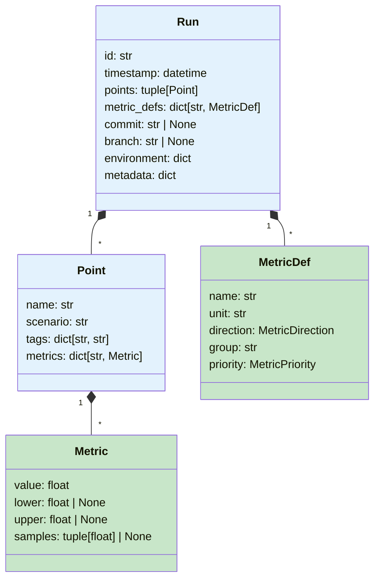
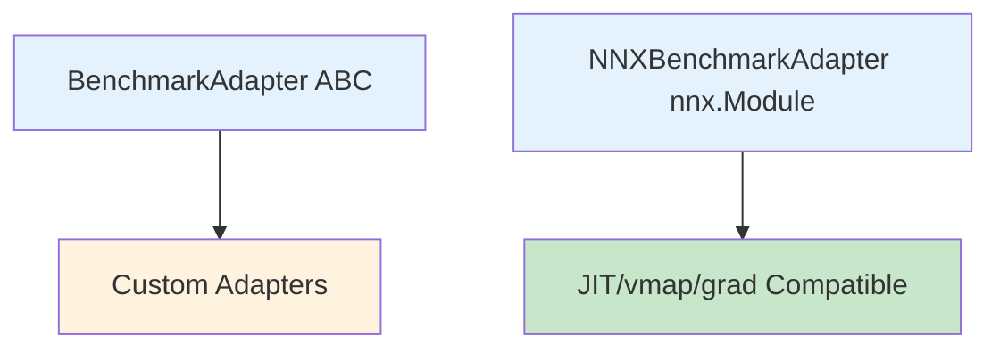

# Core Concepts

This page covers the foundational ideas behind Calibrax: how benchmark data
is structured, how metrics know which direction is "better," how protocols
enable extensibility, and how the benchmark lifecycle fits together.

## Data Model

Calibrax organizes benchmark data into a hierarchy of immutable, serializable
objects. Every object supports `to_dict()` / `from_dict()` round-tripping
for storage and export.



**Run** — A single benchmark execution. Contains one or more measurement points
and the metric definitions that apply across all points. Automatically generates
a unique `id` and `timestamp`.

**Point** — A named measurement within a run (e.g., "forward_pass", "data_loading").
Points carry `tags` for grouping (e.g., `{"framework": "flax"}`) and a dictionary
of metric values.

**MetricDef** — Declares a metric's name, unit, and direction. Metric definitions
live on the `Run` so that analysis tools can interpret values correctly.

**Metric** — A single numeric value with optional confidence interval bounds
(`lower`, `upper`) and raw `samples`.

## Direction-Aware Metrics

Every metric in Calibrax declares whether higher values, lower values, or neither
indicate better performance. This eliminates a common source of bugs in regression
detection and ranking.

| Direction | Regression when... | Best value | Examples |
|-----------|-------------------|------------|----------|
| `HIGHER` | value decreases | maximum | throughput, accuracy, R-squared |
| `LOWER` | value increases | minimum | latency, MSE, energy consumption |
| `INFO` | never | n/a | git commit hash, timestamp, run ID |

```python
from calibrax.core.models import MetricDef, MetricDirection

throughput = MetricDef(
    name="throughput",
    unit="samples/sec",
    direction=MetricDirection.HIGHER,
)

latency = MetricDef(
    name="latency",
    unit="ms",
    direction=MetricDirection.LOWER,
)

commit = MetricDef(
    name="commit",
    unit="",
    direction=MetricDirection.INFO,  # never triggers regressions
)
```

All analysis functions — `detect_regressions()`, `rank_table()`, `pareto_front()`,
`aggregate_score()` — use `MetricDef.direction` to determine comparison semantics
automatically.

## Protocols

Calibrax defines runtime-checkable protocols for benchmarks, datasets, and metrics.
These use Python's structural subtyping, so any class with the right methods
satisfies the protocol — no base class required.

```python
from calibrax.core.protocols import BenchmarkProtocol

# Any class with these methods satisfies BenchmarkProtocol
class MyBenchmark:
    def setup(self) -> None: ...
    def run_training(self) -> dict[str, float]: ...
    def run_evaluation(self) -> dict[str, float]: ...
    def teardown(self) -> None: ...
    def get_performance_targets(self) -> dict[str, float]: ...

assert isinstance(MyBenchmark(), BenchmarkProtocol)  # True
```

Available protocols:

- **`BenchmarkProtocol`** — setup, training, evaluation, teardown, targets
- **`DatasetProtocol`** — `__len__` + `__getitem__`
- **`BatchableDatasetProtocol`** — extends `DatasetProtocol` with `get_batch()`
- **`MetricProtocol`** — `name`, `higher_is_better`, `compute()`, `validate_inputs()`
- **`StatefulMetricProtocol`** — `name`, `update()`, `compute()`, `reset()` for Tier 1-2 metrics
- **`MetricLearningProtocol`** — `__call__(embeddings, labels) -> jax.Array` for Tier 3 losses

## Adapters

Adapters wrap external objects (e.g., Flax NNX models) so they conform to
Calibrax's interfaces. There are two adapter hierarchies:



- **`BenchmarkAdapter`** — An ABC for wrapping non-JAX targets (PyTorch models,
  plain Python objects). Subclass and implement `can_adapt()`.
- **`NNXBenchmarkAdapter`** — Inherits from `nnx.Module` directly, making it
  compatible with `nnx.jit`, `nnx.vmap`, and `nnx.grad`.

!!! tip "Using nnx.jit with NNXBenchmarkAdapter subclasses"

    `NNXBenchmarkAdapter` is intentionally minimal — subclasses in sister repos
    add domain-specific methods like `predict()`, `sample()`, etc.
    Because `nnx.jit` does not support bound methods, call them as unbound
    methods:

    ```python
    from flax import nnx
    from calibrax.core.adapters import NNXBenchmarkAdapter

    class MyAdapter(NNXBenchmarkAdapter):
        def predict(self, x):
            return self.model(x)

    adapter = MyAdapter(my_model)
    # Correct: pass the unbound method + instance
    result = nnx.jit(MyAdapter.predict)(adapter, x)
    ```

The `AdapterRegistry` manages adapter resolution. The default registry
pre-registers `NNXBenchmarkAdapter`:

```python
from calibrax.core.adapters import adapt

wrapped = adapt(my_nnx_model)  # automatically selects NNXBenchmarkAdapter
```

## Benchmark Registry

Use the `@register_benchmark` decorator to register benchmark classes by name.
This enables discovery and lookup without hardcoded imports.

```python
from calibrax.core.registry import register_benchmark, get_benchmark, list_benchmarks

@register_benchmark("mlp_training")
class MLPTrainingBenchmark:
    def setup(self) -> None: ...
    def run_training(self) -> dict[str, float]: ...
    def run_evaluation(self) -> dict[str, float]: ...
    def teardown(self) -> None: ...
    def get_performance_targets(self) -> dict[str, float]: ...

# Later: look up by name
benchmark = get_benchmark("mlp_training")
print(list_benchmarks())  # ["mlp_training"]
```

## Benchmark Lifecycle

A typical benchmarking workflow follows this sequence:

1. **Define** — Create `MetricDef` objects declaring what to measure and which
   direction is better
2. **Profile** — Use `TimingCollector`, `ResourceMonitor`, or other profiling
   tools to collect raw measurements
3. **Collect** — Assemble measurements into `Metric`, `Point`, and `Run` objects
4. **Store** — Save runs to a `Store` and set baselines
5. **Analyze** — Detect regressions, compute statistics, rank configurations,
   fit scaling laws
6. **Export** — Send results to W&B, generate publication tables and plots,
   or gate CI pipelines

## Serialization

All data model objects support JSON serialization via `to_dict()` / `from_dict()`.

```python
from calibrax.core.models import MetricDef, MetricDirection, Metric, Point, Run

run = Run(
    points=(Point(name="fwd", scenario="train", metrics={"loss": Metric(value=0.5)}),),
    metric_defs={"loss": MetricDef(name="loss", unit="", direction=MetricDirection.LOWER)},
)
run_dict = run.to_dict()       # Python dict, JSON-safe
restored = Run.from_dict(run_dict)  # reconstruct the object
```

!!! note "JAX Scalar Handling"

    JAX operations return JAX scalar types (`jnp.float32`, `jnp.int32`) that
    are not directly JSON-serializable. Calibrax automatically converts these
    to native Python `float` and `int` in all `to_dict()` methods.

## Next Steps

<div class="grid cards" markdown>

-   :material-timer:{ .lg .middle } **Profiling**

    ---

    Learn how to collect timing, resource, GPU, energy, and FLOP measurements

    [:octicons-arrow-right-24: Profiling guide](../user-guide/profiling.md)

-   :material-database:{ .lg .middle } **Storage & Baselines**

    ---

    Save runs, manage baselines, extract trends, and ingest external data

    [:octicons-arrow-right-24: Storage guide](../user-guide/storage.md)

-   :material-alert-decagram:{ .lg .middle } **Regression Detection**

    ---

    Detect performance regressions with direction-aware thresholds

    [:octicons-arrow-right-24: Regression guide](../user-guide/regressions.md)

</div>
