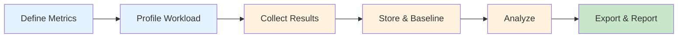

# Calibrax: Unified Benchmarking for JAX Scientific ML

[](https://www.python.org)
[](https://github.com/google/jax)
[](https://github.com/avitai/calibrax/blob/main/LICENSE)

Calibrax is an extensible benchmarking framework for the JAX scientific ML
ecosystem. It provides profiling, statistical analysis, regression detection, and
reporting in a single library — purpose-built for evaluating JAX-based models and
training pipelines.

## Why Calibrax?

Benchmarking scientific ML workloads involves more than timing a function call.
Metrics have directions (throughput should increase, latency should decrease),
results need statistical rigor (confidence intervals, significance tests), and
regressions must be caught automatically in CI. General-purpose tools lack these
domain-specific concepts. Calibrax fills this gap with a unified data model,
direction-aware analysis, and a full pipeline from measurement to publication.

## Features

<div class="grid cards" markdown>

-   :material-timer:{ .lg .middle } **Profiling**

    ---

    Wall-clock timing with GPU sync, resource monitoring, GPU memory analysis,
    energy measurement, and FLOP counting

    [:octicons-arrow-right-24: Profiling guide](user-guide/profiling.md)

-   :material-chart-bell-curve:{ .lg .middle } **Statistical Analysis**

    ---

    Bootstrap confidence intervals, outlier detection, hypothesis testing,
    and effect size estimation

    [:octicons-arrow-right-24: Statistics guide](user-guide/statistics.md)

-   :material-alert-decagram:{ .lg .middle } **Regression Detection**

    ---

    Direction-aware regression detection with configurable thresholds
    and automatic CI gating

    [:octicons-arrow-right-24: Regression guide](user-guide/regressions.md)

-   :material-compare:{ .lg .middle } **Comparison & Ranking**

    ---

    Cross-configuration comparison, Pareto front analysis, aggregate scoring,
    and ranking tables

    [:octicons-arrow-right-24: Comparison guide](user-guide/comparison.md)

-   :material-database:{ .lg .middle } **Storage & Export**

    ---

    JSON-per-run file store with baselines, W&B integration, and
    publication-ready LaTeX/HTML tables and matplotlib plots

    [:octicons-arrow-right-24: Storage guide](user-guide/storage.md)

-   :material-check-decagram:{ .lg .middle } **Validation**

    ---

    Convergence analysis, accuracy assessment, and scientific validation
    reporting against reference implementations

    [:octicons-arrow-right-24: API reference](api-reference/validation.md)

</div>

## Quick Example

```python
from calibrax.core.models import MetricDef, MetricDirection, Metric, Point, Run
from calibrax.storage.store import Store
from calibrax.analysis.regression import detect_regressions

# Define what "better" means for each metric
throughput_def = MetricDef(
    name="throughput", unit="samples/sec", direction=MetricDirection.HIGHER
)
latency_def = MetricDef(
    name="latency", unit="ms", direction=MetricDirection.LOWER
)

# Record benchmark results
point = Point(
    name="forward_pass",
    scenario="training",
    metrics={
        "throughput": Metric(value=1250.0, lower=1200.0, upper=1300.0),
        "latency": Metric(value=0.8, lower=0.75, upper=0.85),
    },
)
run = Run(
    points=(point,),
    metric_defs={"throughput": throughput_def, "latency": latency_def},
)

# Save and detect regressions against a baseline
store = Store("/tmp/benchmarks")
store.save(run)
store.set_baseline(run.id)

# Later, compare a new run against the baseline
new_run = Run(
    points=(Point(
        name="forward_pass", scenario="training",
        metrics={
            "throughput": Metric(value=1100.0),
            "latency": Metric(value=0.9),
        },
    ),),
    metric_defs={"throughput": throughput_def, "latency": latency_def},
)
baseline = store.get_baseline()
if baseline is not None:
    regressions = detect_regressions(new_run, baseline, threshold=0.05)
    for r in regressions:
        print(f"{r.metric}: {r.delta_pct:+.1f}% regression")
```

## Architecture



## Next Steps

<div class="grid cards" markdown>

-   :material-download:{ .lg .middle } **Installation**

    ---

    Set up Calibrax with optional extras for statistics, GPU, and W&B support

    [:octicons-arrow-right-24: Install](getting-started/installation.md)

-   :material-rocket-launch:{ .lg .middle } **Quick Start**

    ---

    Working examples covering profiling, storage, regression detection, and CLI

    [:octicons-arrow-right-24: Quick start](getting-started/quickstart.md)

-   :material-book-open:{ .lg .middle } **Core Concepts**

    ---

    Data model hierarchy, direction-aware metrics, protocols, and the benchmark lifecycle

    [:octicons-arrow-right-24: Concepts](getting-started/concepts.md)

</div>
