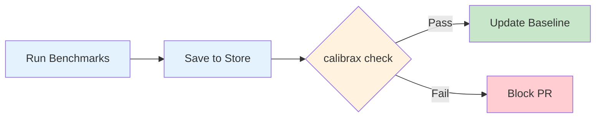

# CI Integration

Calibrax provides two tools for continuous integration: `CIGuard` for gating
pipelines on regression detection, and `BisectionEngine` for automatically
finding the commit that introduced a regression.

## CI Guard

`CIGuard` compares the latest (or specified) run against the stored baseline
and returns a `GuardResult` indicating pass/fail:

```python
from calibrax.storage.store import Store
from calibrax.core.models import MetricDef, MetricDirection, Metric, Point, Run
from calibrax.ci.guard import CIGuard

store = Store("/tmp/calibrax-ci-demo")
run = Run(
    points=(Point(name="fwd", scenario="train",
                  metrics={"throughput": Metric(value=1200.0)}),),
    metric_defs={"throughput": MetricDef(
        name="throughput", unit="samples/sec", direction=MetricDirection.HIGHER)},
)
store.save(run)
store.set_baseline(run.id)

guard = CIGuard(store, threshold=0.05)  # 5% regression threshold

result = guard.check()  # checks latest run against baseline
print(f"Passed: {result.passed}")
print(f"Regressions: {len(result.regressions)}")
print(f"Threshold: {result.threshold}")
print(f"Baseline: {result.baseline_id}")
print(f"Current: {result.current_id}")

if not result.passed:
    for r in result.regressions:
        print(f"  {r.metric}: {r.delta_pct:+.1f}%")
```

To check a specific run instead of the latest:

```python
result = guard.check(run_id=run.id)
```

!!! tip "Threshold Guidance"

    - **5% (default)** — suitable for most metrics, catches meaningful regressions
      while tolerating measurement noise
    - **2-3%** — use for critical metrics like latency in hot paths
    - **10%** — use for noisy metrics like energy or GPU utilization

### CI Failure Signaling

`CIGuard` does not call `sys.exit()` directly — it returns a `GuardResult` so
your script can decide how to handle failures. The CLI `calibrax check` command
handles exit codes automatically (see below).

## CLI-Based CI

The simplest CI integration uses the `calibrax check` command, which exits with
code 1 on regression:

```bash
# Run the regression check
calibrax check --data ./benchmark-data --threshold 0.05

# Exit code 0 = pass, 1 = regression detected
echo $?
```

### GitHub Actions Example

```yaml
name: Benchmark Regression Check

on:
  push:
    branches: [main]
  pull_request:

jobs:
  benchmark:
    runs-on: ubuntu-latest
    steps:
      - uses: actions/checkout@v4

      - name: Set up Python
        uses: actions/setup-python@v5
        with:
          python-version: "3.11"

      - name: Install uv
        uses: astral-sh/setup-uv@v4

      - name: Install dependencies
        run: |
          uv venv
          uv pip install -e ".[stats]"

      - name: Run benchmarks
        run: python run_benchmarks.py --store ./benchmark-data

      - name: Check for regressions
        run: calibrax check --data ./benchmark-data --threshold 0.05

      - name: Update baseline on main
        if: github.ref == 'refs/heads/main' && success()
        run: calibrax baseline --data ./benchmark-data
```

## CodSpeed Benchmarks

Calibrax also includes a focused CodSpeed workflow for PR-level performance
checks. The workflow installs `calibrax[test,performance]`, runs
`tests/performance/`, and uploads CodSpeed results only when repository-side
authentication is configured. Set a repository secret named `CODSPEED_TOKEN`, or
set the repository variable `CODSPEED_OIDC_ENABLED=true` after enabling the
repository in CodSpeed for OpenID Connect uploads. Without either setting, the
workflow still runs the performance smoke tests and skips only the external
upload step.

Local smoke check:

```bash
source activate.sh
uv run --extra performance pytest tests/performance/ --codspeed --no-cov
```

The performance extra installs `pytest-codspeed`; normal unit-test installs do
not need it.



## Bisection Engine

When a regression is detected, `BisectionEngine` binary-searches the git history
to find the commit that introduced it:

```python
from pathlib import Path
from calibrax.ci.bisection import BisectionEngine, BisectionResult
from calibrax.core.models import Metric, Point, Run
from calibrax.analysis.regression import detect_regressions

def run_benchmark(commit: str) -> Run:
    """Check out the commit and run the benchmark suite."""
    # Your benchmark logic here — returns a Run object
    return Run(
        points=(Point(name="fwd", scenario="train",
                      metrics={"throughput": Metric(value=1200.0)}),),
    )

def has_regression(run: Run) -> bool:
    """Return True if the run shows a regression."""
    baseline = store.get_baseline()
    if baseline is None:
        return False
    regressions = detect_regressions(run, baseline, threshold=0.05)
    return len(regressions) > 0

engine = BisectionEngine(
    repo_path=Path("."),
    benchmark_fn=run_benchmark,
    regression_fn=has_regression,
)

# Call engine.bisect() with known good and bad commit hashes:
# result = engine.bisect(good_commit="abc123", bad_commit="def456")
# print(f"Culprit: {result.culprit_commit}")
# print(f"Steps: {result.total_steps}")
# print(f"Commits tested: {len(result.tested_commits)}")
```

!!! note "HEAD Restoration"

    `BisectionEngine` restores the original HEAD in a `finally` block after
    bisection completes, regardless of success or failure.

## Best Practices

- Run benchmarks on dedicated hardware with minimal background load for
  consistent results
- Use separate thresholds for different metric categories — tighter for latency,
  looser for energy
- Update baselines only on the main branch after a successful check
- Store benchmark data in a persistent location (not a temporary CI directory)
  so trends accumulate across runs
- Use `BisectionEngine` sparingly — it checks out commits and runs full
  benchmarks, which can be time-consuming

## Next Steps

<div class="grid cards" markdown>

-   :material-monitor-dashboard:{ .lg .middle } **Production Monitoring**

    ---

    Monitor deployed models with alerts and health reports

    [:octicons-arrow-right-24: Monitoring](monitoring.md)

-   :material-database:{ .lg .middle } **Storage & Baselines**

    ---

    Manage the store and baseline strategy that CI depends on

    [:octicons-arrow-right-24: Storage](storage.md)

</div>
