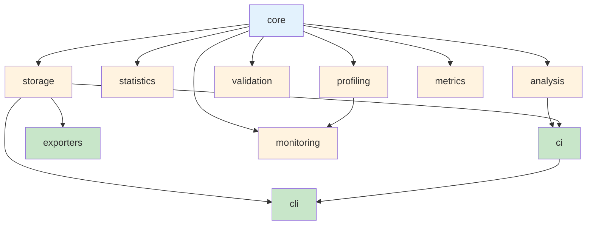

# Overview

Calibrax is an extensible benchmarking framework designed for the JAX scientific
ML ecosystem. It provides a complete toolkit for profiling workloads, analyzing
results with statistical rigor, detecting regressions, and exporting
publication-ready reports.

## Design Principles

**Composition over inheritance** — `BenchmarkResult` uses composed objects
(timing, resources, metrics) rather than flat monolithic fields. Each concern
is modeled by a dedicated dataclass that can be used independently.

**Protocol-driven** — Universal protocols (`BenchmarkProtocol`, `DatasetProtocol`,
`MetricProtocol`) use structural subtyping so any class with the right methods
satisfies the contract — no base class required.

**Direction-aware metrics** — Every metric declares whether higher or lower is
better via `MetricDirection`. All analysis functions use this direction to
determine comparison semantics, eliminating a common source of regression
detection bugs.

**JAX-native** — Statistical computations use JAX where possible. Profiling tools
support GPU synchronization via `sync_fn` callbacks. The `NNXBenchmarkAdapter`
inherits from `nnx.Module` for JIT/vmap/grad compatibility.

**Zero lock-in** — Clean abstractions and protocols allow domain-specific
extensions without importing Calibrax internals.

## Module Map

## Modules

| Module | Purpose |
|--------|---------|
| [`calibrax.core`](../api-reference/core/models.md) | Data models, protocols, adapters, result container, registry |
| [`calibrax.profiling`](../api-reference/profiling/timing.md) | Timing, resource monitoring, GPU memory, energy, FLOPS |
| [`calibrax.statistics`](../api-reference/statistics.md) | Bootstrap CI, hypothesis tests, effect sizes, outlier detection |
| [`calibrax.analysis`](../api-reference/analysis.md) | Regression detection, comparison, ranking, scaling, Pareto |
| [`calibrax.validation`](../api-reference/validation.md) | Convergence, accuracy assessment, validation framework |
| [`calibrax.monitoring`](../api-reference/monitoring.md) | Alert management, production monitoring |
| [`calibrax.storage`](../api-reference/storage.md) | JSON-per-run store, baseline repository |
| [`calibrax.exporters`](../api-reference/exporters.md) | W&B, MLflow, publication-ready LaTeX/HTML/CSV/matplotlib output |
| [`calibrax.metrics`](../api-reference/metrics/index.md) | 4-tier metric system with 110+ registered metrics across 17 domains |
| [`calibrax.ci`](../api-reference/ci.md) | CI regression gate, git bisect automation |
| [`calibrax.cli`](../cli-reference.md) | Command-line interface |

## Reading Paths

**Benchmarking a JAX model for the first time:**
[Core Concepts](../getting-started/concepts.md) →
[Profiling](profiling.md) →
[Storage](storage.md) →
[Regressions](regressions.md)

**Setting up CI regression checks:**
[Storage](storage.md) →
[Regressions](regressions.md) →
[CI Integration](ci-integration.md)

**Comparing framework configurations:**
[Profiling](profiling.md) →
[Comparison](comparison.md) →
[Exporters](exporters.md)

**Publishing benchmark results:**
[Statistics](statistics.md) →
[Comparison](comparison.md) →
[Exporters](exporters.md)
